# 家庭成长跟踪架构设计

**Document status:** APPROVED
**Baseline candidate:** FGT-MVP-1.6
**Decision records:**

- [ADR-0001: 复用现有服务](decisions/0001-reuse-existing-services.md)
- [ADR-0002: 家庭数据隔离](decisions/0002-family-data-isolation.md)
- [ADR-0003: 家庭本地日期](decisions/0003-family-local-date.md)
- [ADR-0004: 单次成长任务](decisions/0004-single-occurrence-growth-tasks.md)
- [ADR-0005: 幂等星星流水](decisions/0005-idempotent-star-ledger.md)
- [ADR-0006: Gateway 签名身份信封](decisions/0006-signed-gateway-identity-envelope.md)
- [ADR-0007: 稳定的成长周报历史](decisions/0007-stable-weekly-report-history.md)

Task 5~11 的详细设计由对应 spec 和 gate 承载；跨服务调用顺序见
[家庭成长跟踪跨服务时序图](sequence-diagrams.md)。

## 1. 架构目标

家庭成长跟踪第一阶段的目标是把现有学校级 LMS 收敛为一个轻量、稳定、可演示的家庭成长闭环：

```text
家长账号
  -> 家庭与孩子档案
  -> 德智体美劳成长任务
  -> 孩子完成和自评
  -> 家长确认和反馈
  -> 智育错题 / 成长过程记录
  -> 成长周报和提醒
```

第一阶段不新增微服务，不强化学校组织结构。系统继续复用现有服务目录，但把公开接口和前端入口收敛到家庭成长场景。

## 2. MVP 业务组件架构图

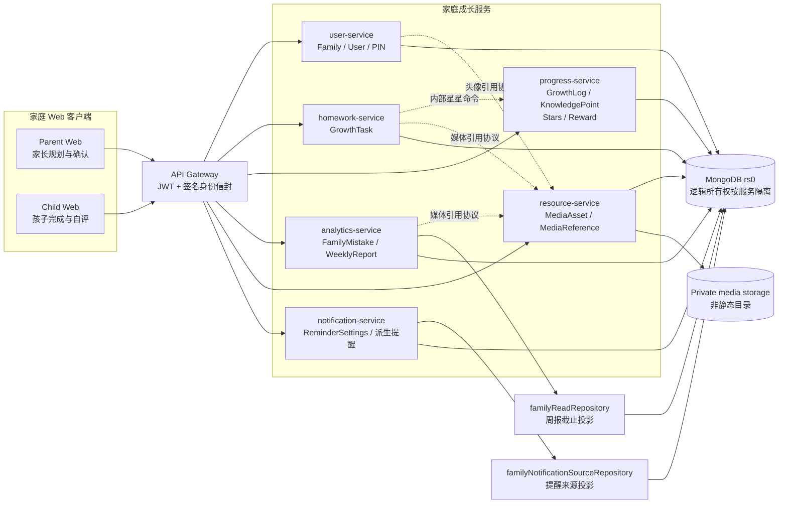

实线表示公开请求或持久化读取，点线表示带独立服务凭据的内部命令。MongoDB 在
MVP 部署中是同一副本集，但共享物理数据库不改变第 3 节的数据写入所有权。

## 3. 服务映射

| 现有服务 | 家庭成长版职责 | 第一阶段策略 |
| --- | --- | --- |
| `user-service` | 家庭、家长、孩子档案、孩子 PIN 登录 | 保留用户模型兼容字段，新增 `familyId`、`childProfile`、`parentProfile` |
| `homework-service` | 成长任务 `GrowthTask` | 保留旧 `Homework` 路由，新增 `/api/growth-tasks` |
| `progress-service` | 每日成长记录 `GrowthLog`、能力点、星星账户和奖励 | 保留旧进度模型，新增成长记录、能力点、积分流水和奖励路由 |
| `analytics-service` | 智育错题、固定模板成长周报、维度均衡统计 | 不做 AI 分析和复杂报表，先做确定性聚合 |
| `resource-service` | 任务附件、错题图片、成长过程图片 | 只保留最小上传和关联能力 |
| `notification-service` | 今日任务、未完成、错题复习、锻炼、习惯、周报提醒 | 第一阶段按读取时派生提醒，不引入后台定时任务 |
| `interaction-service` | 亲子反馈和孩子自评的后续扩展 | 第一阶段暂停会议、公告、群聊和复杂消息 |
| `gateway` | 统一鉴权、路由代理、下游用户头传递 | 继续作为本地 Demo 统一入口 |

`interaction-service` 仍可能出现在 `docker-compose.yml`、`docker-compose.china.yml` 和 Kubernetes 清单中，这是为了保留旧学校版路由和回滚兼容性，不表示家庭 MVP 首轮依赖它。家庭成长主流程不得把会议、公告、群聊或复杂消息作为必需启动条件；本地或发布流水线需要最小家庭 Demo 时，可只验证第 9 节列出的必要组件。

### 3.1 跨服务读取与聚合策略

第一阶段继续使用同一个 MongoDB，但必须保留明确的数据所有权：

- `homework-service` 是成长任务的唯一写入方。
- `progress-service` 是成长记录、能力点、星星流水和奖励的唯一写入方。
- `analytics-service` 是错题和周报反馈的唯一写入方。
- `notification-service` 不持有任务、错题或周报副本，只派生查询结果。
- `analytics-service` 生成周报时调用 `backend/common/repositories/familyReadRepository.js`。该只读仓储通过显式集合名和最小字段投影读取 MongoDB，只暴露按 `familyId + childId + LocalDate + cutoff` 收敛的查询；它不注册写模型，也不允许写入其他服务集合。
- `notification-service` 当前调用服务内的 `familyNotificationSourceRepository.js`，以带 `familyId + childId + LocalDate` 和 `maxTimeMS` 的只读 Mongoose 投影读取任务、错题、记录和周报存在性。该适配器会导入模型定义，但不暴露写方法；这是现有 MVP 实现边界，不应误写成公共 `familyReadRepository`。
- 只读仓储的查询必须设置超时；任一数据源失败时，周报返回 `503 AGGREGATION_UNAVAILABLE`，提醒接口返回已有分区结果并在 `meta.partial=true` 中声明降级，禁止静默返回完整成功结果。

这两个只读适配器都是迁移阶段的临时边界。未来服务独立数据库后，应替换为内部
HTTP API 或事件构建的读模型，业务接口不改变。

### 3.2 日期与时区规则

- `Family.timezone` 使用 IANA 时区名，默认 `Asia/Shanghai`。
- `dueDate`、`GrowthLog.date`、`reviewReminderDate` 和 `weekStart` 均为 `YYYY-MM-DD` 的 `LocalDate`，不携带 UTC 偏移。
- `today` 按家庭时区计算；周从周一开始，到周日结束，查询区间两端均包含。
- 时间戳字段继续使用 UTC ISO 8601，例如 `completedAt`。
- 第一阶段每条任务只代表一次发生，不实现重复任务规则。每日习惯通过每天一条任务表达；重复任务模板推迟到第二阶段，避免单一任务状态无法表示“本周完成 4/7 次”。

### 3.3 Gateway 到下游服务的信任边界

```text
client JWT
  -> gateway 删除客户端提供的 x-user-* 和内部认证头
  -> gateway 验证 JWT
  -> gateway 签名 method + normalizedPath + userId + role + timestamp + nonce
  -> 下游验证签名、5 分钟新鲜度和 nonce 未重放
  -> 业务路由校验 familyId + childId 资源归属
```

- 身份信封使用独立的服务密钥，禁止复用 `JWT_SECRET`。
- gateway 必须覆盖而不是透传客户端身份头，包括 `x-user-id`、`x-user-role`、`x-user-name`、签名、时间戳和 nonce。
- 下游 `authenticateGateway` 必须先验签再构造 `req.user`，不能仅凭 `x-user-*` 信任调用者。
- nonce 在签名有效期内只能使用一次；签名篡改、时间戳超过 5 分钟或 nonce 重放都返回 `401`。
- 内部命令接口使用独立服务凭据，不能接受普通家长或孩子 token。
- Task 5 星星发放接口使用至少 32 字节的独立共享服务令牌并做恒定时间比较；该接口不经过 gateway，令牌不得复用 JWT 或 gateway 身份密钥。
- 网络隔离是纵深防御，不能替代请求级服务认证；未来可以等价替换为 mTLS 或下游直接验证 JWT。

### 3.4 服务组件职责与接口边界

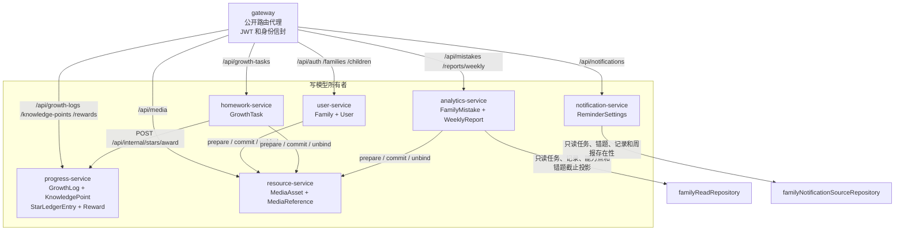

| 服务 | 独占写模型 | 跨域读取或调用 | 公开路由 | 内部接口 |
| --- | --- | --- | --- | --- |
| `gateway` | 无 | 验证 JWT，覆盖客户端身份头，签发下游身份信封 | 所有 `/api/*` 家庭入口 | 无；不得直接写域数据 |
| `user-service` | `Family`、家庭字段下的 `User` | 绑定孩子头像时调用媒体引用协议 | `/api/auth/*`、`/api/families*`、`/api/children*` | 媒体引用协议调用方 |
| `homework-service` | `GrowthTask` | 校验家庭/孩子；确认任务时调用星星命令；附件变更时调用媒体引用协议 | `/api/growth-tasks*` | 调用 `/api/internal/stars/award` 和媒体引用协议 |
| `progress-service` | `GrowthLog`、`KnowledgePoint`、掌握事件、`StarLedgerEntry`、`StarLedgerGuard`、`Reward` | 校验家庭/孩子；余额由不可变流水聚合 | `/api/growth-logs*`、`/api/knowledge-points*`、`/api/rewards*` | 提供 `POST /api/internal/stars/award` |
| `analytics-service` | `FamilyMistake`、错题状态事件、`WeeklyReport` | 经只读仓储读取任务、记录、能力点和错题截止快照；错题图片调用媒体协议 | `/api/mistakes*`、`/api/reports/weekly*` | 媒体引用协议调用方 |
| `resource-service` | `MediaAsset`、`MediaReference` | 校验家庭/孩子；读写私有对象目录 | `/api/media*` | 提供 `/api/internal/media/references/{prepare,commit,unbind}` |
| `notification-service` | `ReminderSettings` | 经服务内只读来源仓储并行读取任务、错题、记录和周报存在性 | `/api/notifications/family`、`/api/notifications/settings` | 无；读取失败以 `meta.partial` 暴露 |

服务之间不共享可写 Mongoose 模型。周报公共只读仓储和提醒来源仓储都要求
`familyId + childId`、LocalDate/截止时间和超时参数，并只返回最小投影；任何新增
写路径都必须回到该模型的所有者服务。未来服务拆分数据库时，两者都要替换为内部
HTTP API 或事件读模型。

## 4. 核心域模型

### 4.1 Family

家庭是第一阶段的数据隔离边界。

关键字段：

- `familyId`
- `familyName`
- `timezone`
- `ownerParentId`
- `memberParentIds`
- `childIds`

| Field | Type | Required/default | Index and lifecycle |
| --- | --- | --- | --- |
| `_id` / `familyId` | ObjectId | required/generated | primary family boundary |
| `familyName` | String | required, trimmed, max 50 | mutable by family parent |
| `timezone` | String | required, default `Asia/Shanghai`, valid IANA name | mutable; new value affects future date interpretation only |
| `ownerParentId` | ObjectId | required | unique; one owned family per parent |
| `memberParentIds` | ObjectId[] | default owner | multikey lookup index |
| `childIds` | ObjectId[] | default empty | multikey lookup index; child must also carry same familyId |

家庭不在 MVP 中物理删除。停用家庭版路由不会删除家庭数据。

### 4.2 User

现有 `User` 模型继续保留 `parent` 和 `student` 角色。教师、管理员等旧角色不进入 MVP 导航，但为了减少迁移风险，第一阶段不删除旧枚举。

新增家庭字段：

- `familyId`
- `parentProfile.familyRole`
- `parentProfile.defaultChildId`
- `childProfile.nickname`
- `childProfile.school`
- `childProfile.grade`
- `childProfile.textbookVersion`
- `childProfile.interests`
- `childProfile.weakSubjects`
- `childProfile.sportsPreferences`
- `childProfile.artInterests`
- `childProfile.laborHabits`
- `childProfile.moralGoals`
- `childProfile.pinHash`
- `childProfile.tokenVersion`

| Field | Type | Required/default | Constraint |
| --- | --- | --- | --- |
| `familyId` | ObjectId | optional for legacy users, required for family parent/child | indexed with role |
| `childProfile.pinHash` | String | optional, `select: false` | bcrypt hash only; never returned |
| `childProfile.tokenVersion` | Number | required for family child, default `0` | incremented on PIN reset |
| `parentProfile.familyRole` | Enum | default `guardian` | `father|mother|guardian|other` |
| `parentProfile.defaultChildId` | ObjectId | optional | must reference same-family child |

旧教师、管理员和学生字段保留，但家庭版授权只使用 `familyId` 和资源归属，不使用 `class`、`parentId` 或旧 `children` 数组作为唯一依据。

### 4.3 GrowthTask

`GrowthTask` 是第一阶段替代学校作业的核心模型。每条任务必须属于一个成长维度。

维度枚举：

- `moral`：德育
- `academic`：智育
- `physical`：体育
- `artistic`：美育
- `labor`：劳育

关键字段：

- `taskId`
- `familyId`
- `childId`
- `dimension`
- `area`
- `subject`
- `title`
- `taskType`
- `description`
- `dueDate`
- `estimatedMinutes`
- `actualMinutes`
- `targetAmount`
- `actualAmount`
- `unit`
- `status`
- `difficulty`
- `needsHelp`
- `parentConfirmed`
- `childNote`
- `parentFeedback`
- `starAwardState: not_applicable|pending|awarded`

第一阶段不包含 `repeatRule`。重复任务进入第二阶段时，必须引入独立的任务模板和任务 occurrence，不能在单条任务上复用一个完成状态。

| Field | Type | Required/default | Constraint/index |
| --- | --- | --- | --- |
| `familyId` | ObjectId | required | compound indexes start with familyId |
| `childId` | ObjectId | required | must belong to familyId |
| `createdByParentId` | ObjectId | required | must be a parent in familyId |
| `dimension` | Enum | required | `moral|academic|physical|artistic|labor` |
| `dueDate` | String | required | `YYYY-MM-DD` LocalDate |
| `status` | Enum | default `pending` | `pending|completed|confirmed|cancelled|archived` |
| `starAwardState` | Enum | default `not_applicable` | `not_applicable|pending|awarded` |
| `completedAt`, `confirmedAt`, `cancelledAt` | Date | optional | UTC event timestamps |

Required indexes:

```text
{ familyId: 1, childId: 1, dueDate: 1 }
{ familyId: 1, childId: 1, dimension: 1, status: 1 }
```

#### GrowthTask 状态机

| Current | Command | Actor | Next/result |
| --- | --- | --- | --- |
| none | create | parent | `pending` |
| pending | edit | parent | `pending` |
| pending/completed | complete | parent or child self | `completed`; update completion evidence |
| completed | confirm | parent | `confirmed`; Task 5 adds idempotent star award |
| pending | delete | parent | `cancelled`; set `cancelledAt`, retain row for audit/report cutoff |
| completed/confirmed | delete | parent | `archived` |
| confirmed/cancelled/archived | complete or edit | any | `409 TASK_STATE_CONFLICT` |
| any | create/edit with repeatRule | parent | `400 REPEAT_RULE_NOT_SUPPORTED` |

```mermaid
stateDiagram-v2
  state "pending" as Pending
  state "completed" as Completed
  state "confirmed / star pending" as ConfirmPending
  state "confirmed / star awarded" as Confirmed
  state "cancelled" as Cancelled
  state "archived" as Archived

  [*] --> Pending: parent creates
  Pending --> Pending: parent edits
  Pending --> Completed: parent or child completes
  Completed --> Completed: completion evidence updated
  Completed --> ConfirmPending: parent confirms with CAS
  ConfirmPending --> Confirmed: idempotent star award succeeds
  ConfirmPending --> ConfirmPending: award timeout or final update failure
  Confirmed --> Confirmed: repeated confirm returns existing result
  Pending --> Cancelled: parent deletes
  Completed --> Archived: parent deletes
  ConfirmPending --> Archived: parent deletes
  Confirmed --> Archived: parent deletes
  Cancelled --> Cancelled: repeated DELETE returns retained row
  Archived --> Archived: repeated DELETE returns retained row
```

`ConfirmPending` 是可恢复状态而不是回滚点：星星流水可能已经成功写入但任务最终
更新失败。再次确认使用同一任务 ID 重放内部命令，读取原流水后收敛为图中的
`Confirmed` 状态，不会重复发放。当前删除路由也允许把 `ConfirmPending` 归档；
归档后公开 confirm 不再恢复发放，因此该分支必须保留为已知实现限制，不能描述为
已经收敛到 `awarded`。

### 4.4 GrowthLog

`GrowthLog` 记录每日成长过程。它不是只记录课内学习，也记录体育、艺术、劳动和习惯状态。

关键字段：

- `logId`
- `familyId`
- `childId`
- `date`
- `dimension`
- `area`
- `subject`
- `content`
- `durationMinutes`
- `amount`
- `unit`
- `completedTaskIds`
- `focusLevel`
- `difficulty`
- `physicalState`
- `mood`
- `childReflection`
- `parentNote`

### 4.5 KnowledgePoint

`KnowledgePoint` 在智育中表示知识点，在其他维度中表示能力点或习惯点。

示例：

- 智育：分数计算、英语单词、阅读理解。
- 体育：跳绳耐力、跑步配速、篮球运球。
- 美育：节奏练习、线条观察、色彩搭配。
- 劳育：整理房间、洗碗、照顾植物。
- 德育：按时睡觉、主动道歉、遵守约定。

### 4.6 FamilyMistake

错题属于智育专项能力，`dimension` 固定为 `academic`。错题不应成为整个系统的唯一中心。

### 4.7 WeeklyReport

周报必须同时展示：

- 总记录天数。
- 总投入时长。
- 任务完成率。
- 德智体美劳任务分布。
- 德智体美劳投入时长分布。
- 智育错题和待复习知识点。
- 体育、美育、劳育、德育的完成情况。
- 家长反馈、孩子自评和下周建议。

周报查询是确定性、幂等的读取操作，缓存键为 `familyId + childId + weekStart`。当前周的统计是可失效缓存，源任务、记录或错题变化后重新计算；已结束自然周首次成功生成后冻结统计快照，后续只允许更新反馈字段。

统计边界统一换算为家庭时区中的 `[weekStart 00:00, weekEnd 23:59:59.999]`：

- `plannedTaskCount`：`dueDate` 在周内、创建时间不晚于周末，且未在周末前取消的任务数。周末后取消不改变历史分母。
- `completedTaskCount`：上述计划任务中 `completedAt` 不晚于周末的任务数。周末后的补完成不改变历史分子。
- `taskCompletionRate`：分母大于 0 时为两者相除，否则为 `null`。
- `totalDurationMinutes`、`dimensionDurations`、`subjectDurations`：只汇总周内 `GrowthLog.durationMinutes`；任务 `actualMinutes` 不参与时长合计，避免重复。
- 错题数按 `FamilyMistake.createdAt` 的家庭本地日期落周；待复习知识点按周末快照状态计算。

`cancelled` 和 `archived` 都保留原始 `dueDate`、`completedAt` 等证据，禁止物理删除家庭成长任务。

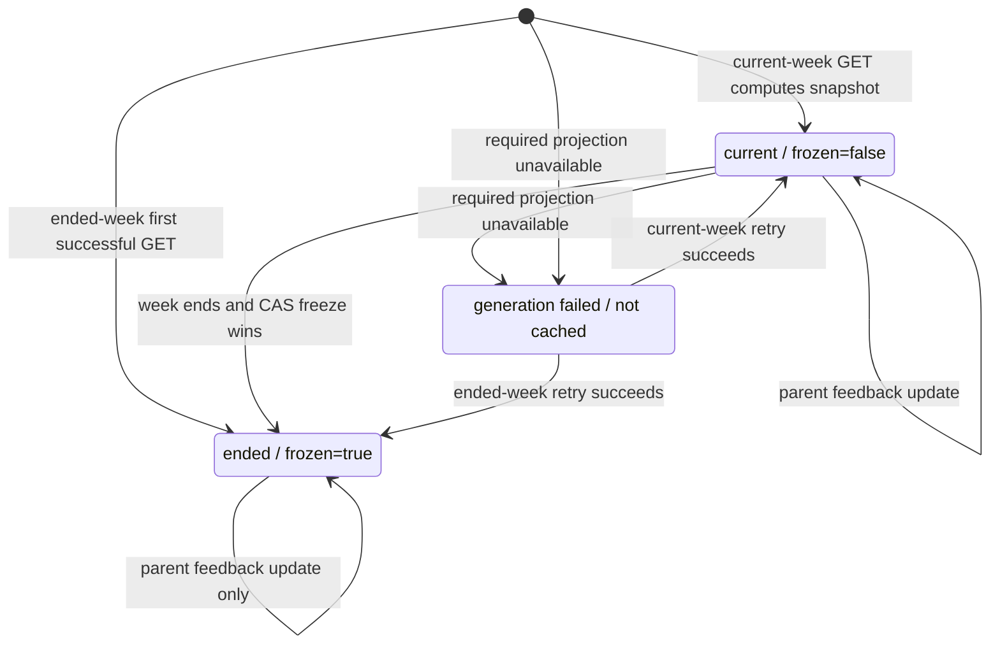

`Failed` 不对应数据库记录：任一必需投影超时、历史事件不完整或冻结竞争在有限重试
后仍不可见时返回 `503 AGGREGATION_UNAVAILABLE`，不得把空统计写入缓存。冻结后只
允许修改反馈字段，不允许重算统计或恢复为 current。

### 4.8 ReminderSettings 与 MediaAsset

`ReminderSettings` 由 `notification-service` 独占写入，每个 `familyId` 唯一，保存提醒开关、ISO 周报日和家庭本地安静时段。提醒按读取时派生，以 `type + childId + LocalDate + sourceId` 去重；不在第一阶段引入后台推送任务。

`MediaAsset` 由 `resource-service` 独占写入。对象存储键只保存在服务端，数据库保存 `familyId`、可选 `childId`、purpose、MIME、大小和软删除状态。上传链路校验 JPEG/PNG/WebP 和 10 MiB 上限、剥离 EXIF；读取链路先做家庭/孩子授权，再返回不超过 5 分钟的授权 URL。业务模型只能引用 `active` 且 scope/purpose 匹配的 `mediaId`。删除后立即禁止读取和新引用，解除引用后 30 天物理清理。

#### MediaAsset 状态机

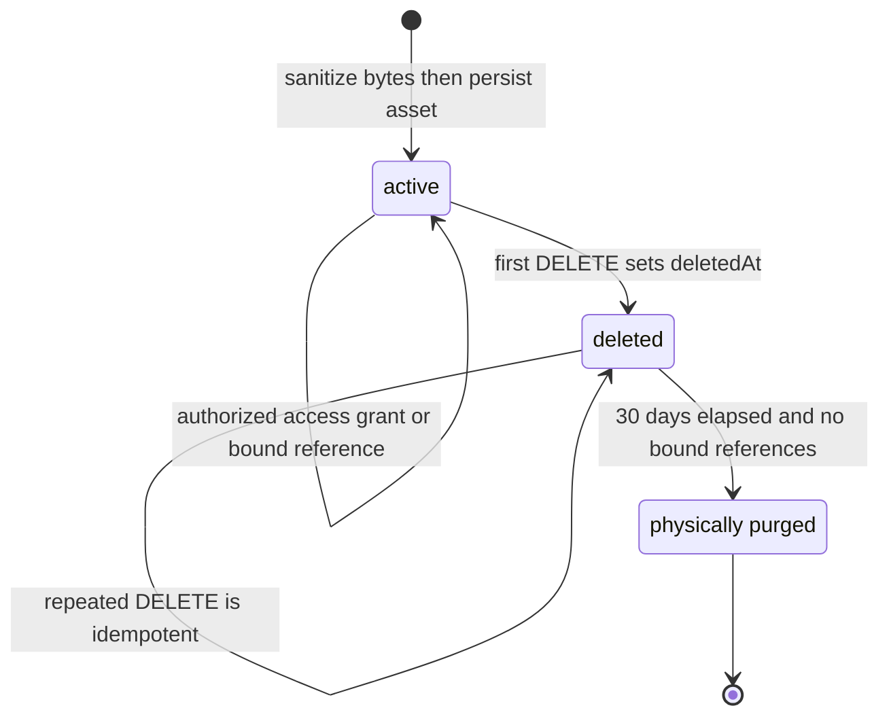

软删除立即拒绝授权读取和新的 prepare，但不会偷偷释放仍有效的业务引用。物理清理
以 `deletedAt` 和最后一个 bound 引用的 `releasedAt` 中较晚者为起点计算 30 天。

#### MediaReference 状态机

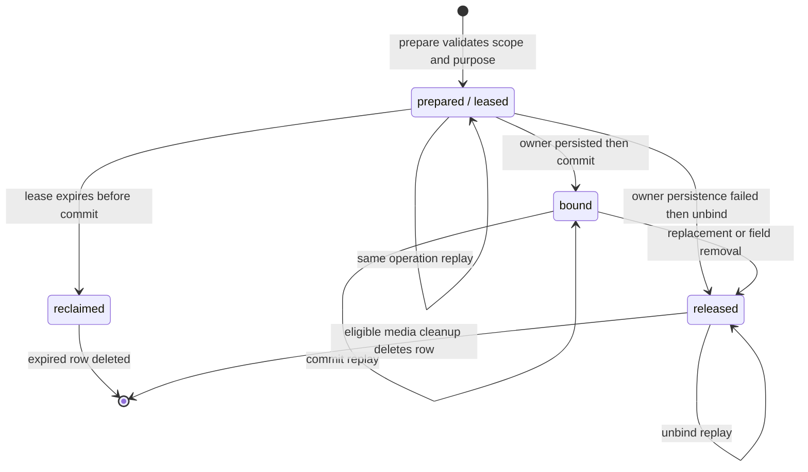

业务模型的 `mediaReferenceState=none|pending|bound` 是跨服务恢复标记；权威引用状态
仍在 resource-service 的 `MediaReference`。新绑定先 commit，旧绑定后 unbind，保证
替换期间不会出现新旧对象同时失去保留依据。

### 4.9 StarLedgerEntry 与 Reward

星星使用不可变流水记录，不在 `User` 或 `Reward` 上直接维护可被并发覆盖的余额。

`StarLedgerEntry` 关键字段：

- `familyId`
- `childId`
- `type: earn|spend|adjust`
- `amount`
- `sourceType: task_confirmation|reward_redemption|parent_adjustment`
- `sourceId`
- `createdBy`
- `createdAt`

`familyId + childId + sourceType + sourceId + type` 必须建立唯一索引。家长首次确认任务后，任务先进入 `confirmed + starAwardState=pending`，随后 `homework-service` 调用 `progress-service` 内部积分命令；命令使用任务 ID 作为幂等来源，每个确认任务固定发放 1 颗星，重试不得重复加星。成功后任务更新为 `starAwardState=awarded`；失败返回 `503 STAR_AWARD_PENDING`，任务保持 confirmed 时再次确认会重试未完成的发放。余额由流水求和得到，兑换奖励必须在一个事务中写入扣减流水并更新 `Reward.status`。

第一阶段只实现星星余额和家庭奖励兑换。徽章不进入 MVP，避免在没有规则版本、授予记录和撤销语义时只做静态展示。

#### 星星发放状态机

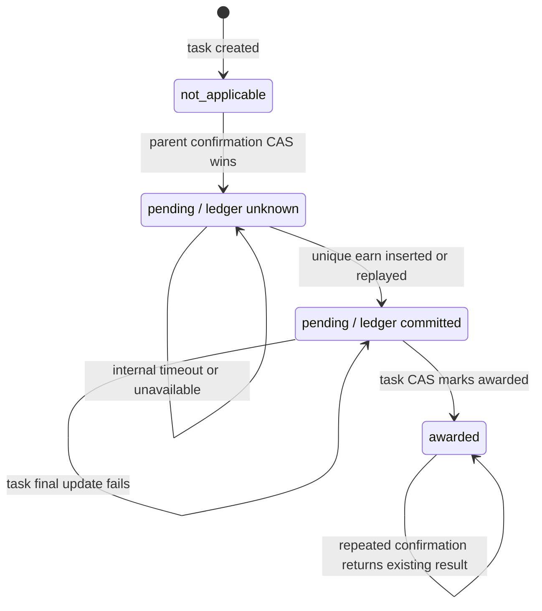

`LedgerCommitted` 是跨服务推理状态，不是额外数据库字段。任务仍保存 `pending`，但
`StarLedgerEntry` 的唯一索引已经证明发放完成；下一次调用按任务 ID 读回原流水并
完成任务侧 CAS。

#### 奖励兑换状态机

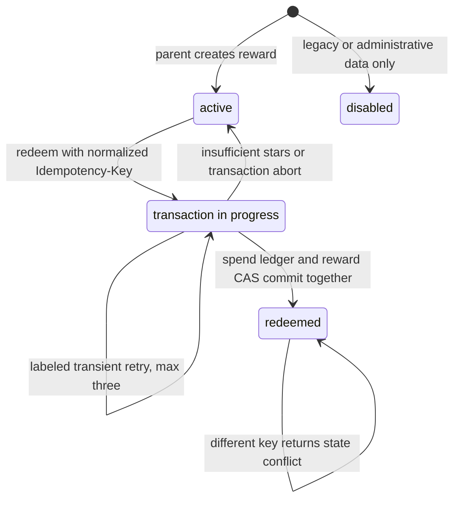

兑换必须在 MongoDB 副本集事务中同时写扣减流水并把奖励改为 `redeemed`。余额不足、
幂等键复用到其他操作或事务最终失败时不产生部分扣减。`disabled` 是模型兼容状态，
当前 MVP 没有公开的禁用命令。

### 4.10 核心实体关系

下图只展示家庭成长 MVP 的权威实体和关键关联，不展开旧学校版 Class、Homework
等兼容模型。所有孩子域实体除 `childId` 外都携带 `familyId`，授权查询必须同时
收敛两个边界。

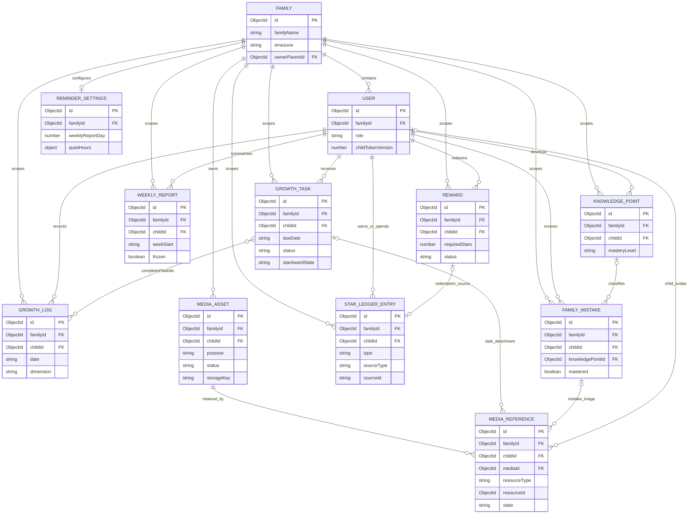

## 5. 数据归属规则

所有家庭数据必须满足以下规则：

1. 家庭级对象必须携带 `familyId`。
2. 孩子拥有的数据必须同时携带 `familyId` 和 `childId`。
3. 任务、记录、错题、奖励、周报和提醒都不得只依赖用户角色判断访问权限。
4. 查询列表时必须先按 `familyId` 收敛，再按 `childId`、`dimension`、日期等业务条件过滤。
5. 跨服务数据聚合时，`childId` 只能在同一个 `familyId` 内使用。
6. 所有唯一索引都必须包含 `familyId`；调用者提供的 `familyId` 不可信，必须从已验证 token 和孩子归属关系推导。

## 6. 权限规则

### 6.1 权限矩阵

| Resource/action | Parent in family | Child self | Sibling | Other-family parent | Anonymous |
| --- | --- | --- | --- | --- | --- |
| Family read/update | allow | deny | deny | deny | deny |
| Child create/update | allow | deny | deny | deny | deny |
| Child profile read | allow | allow | deny | deny | deny |
| Child list | allow | deny | deny | deny | deny |
| PIN set/reset | allow | deny | deny | deny | deny |
| PIN login | public credential flow | public credential flow | public credential flow | public credential flow | public credential flow |
| Task list/detail | allow | allow own | deny | deny | deny |
| Task create/edit | allow | deny | deny | deny | deny |
| Task complete | allow | allow own | deny | deny | deny |
| Task confirm/delete | allow | deny | deny | deny | deny |
| Growth logs/mistakes | allow | allowed self fields | deny | deny | deny |
| Reports/rewards | allow | read own only | deny | deny | deny |

PIN 登录虽然不要求已有 token，仍必须使用统一凭据错误和限流，不能泄露家庭或孩子是否存在。

### 6.2 家长

家长可以：

- 查看和编辑自己家庭信息。
- 添加、查看、编辑自己家庭下的孩子。
- 为自己家庭下的孩子创建、编辑、确认任务。
- 查看和维护自己家庭下孩子的成长记录、错题、能力点、奖励和周报。

家长不能：

- 访问其他家庭的孩子。
- 访问其他家庭的任务、记录、错题、奖励和周报。

### 6.3 孩子

孩子可以：

- 使用 PIN 进入简化入口。
- 查看自己的今日任务、成长记录、错题复习和奖励。
- 标记自己的任务完成。
- 写自评、难度、实际用时、实际数量和是否需要帮助。

孩子不能：

- 查看兄弟姐妹的数据。
- 创建或确认家长任务。
- 修改家长反馈。
- 访问家长端设置。

### 6.4 教师和管理员

教师、管理员、班级和学校相关路由第一阶段仅作为旧代码兼容保留，不出现在 MVP 导航和演示闭环中。

## 7. 兼容、迁移与回滚

- MVP 保留 `Homework`、旧进度模型及学校角色枚举，不执行破坏性迁移。
- 新家庭路由只写入家庭域字段和新模型，旧学校路由不写入 `GrowthTask`。
- 家庭版 UI 隐藏学校、班级、教师和管理员入口，但不删除对应后端路由。
- 回滚通过停用家庭版 gateway 路由和 UI 导航完成，不删除家庭数据或旧学校数据。
- 当前 BSON Date 形式的家庭任务 `dueDate` 在切换到 LocalDate String 前必须另写迁移脚本：按家庭时区转换、验证 `YYYY-MM-DD`、保留备份字段并支持回滚。门禁整改期间没有已发布家庭数据时，可以通过测试数据库重建完成切换。
- 任何已批准基线语义变化都必须创建新 ADR 或更新替代 ADR，并同步 API、追踪矩阵和测试。

## 8. 前端信息架构

### 8.1 家长 Web 端

首轮导航：

- 首页
- 任务
- 记录
- 错题
- 成长
- 进度
- 孩子
- 设置

首页必须突出：

- 今日任务。
- 本周完成率。
- 本周成长投入时长。
- 德智体美劳分布。
- 待复习错题。
- 需要帮助。
- 本周鼓励语。

### 8.2 孩子简化入口

首轮导航：

- 今天
- 错题
- 成就
- 我的

孩子入口只保留完成、反馈和自评动作，不提供复杂管理能力。

### 8.3 Web 会话和页面状态

家长和孩子使用独立的路由守卫与会话存储键。身份恢复完成前不渲染受保护页面；`401` 清除当前身份并回到对应登录页，`403` 显示无权限且不自动切换资源。家长切换孩子时取消旧请求、清空旧孩子查询缓存，再加载新孩子数据。

所有数据页面必须显式实现 loading、empty、retryable error 和 partial 四种状态；写操作禁用重复提交。布局支持 360px 到桌面宽度，核心流程可用键盘操作，控件具备可访问名称，状态同时使用文字或图标而非只用颜色。

#### 孩子会话与 stale token 状态机

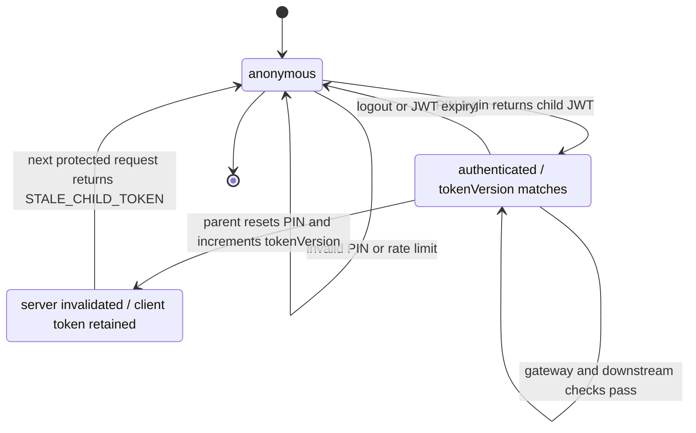

Gateway 先验证 JWT 并签发包含 `familyId`、`childId`、`tokenVersion` 的身份信封；
下游服务再读取当前孩子版本。版本不一致返回 `401 STALE_CHILD_TOKEN`，`childApi`
触发会话过期事件、清除独立孩子存储并跳回 `/child/login`。

### 8.4 前端组件与数据边界

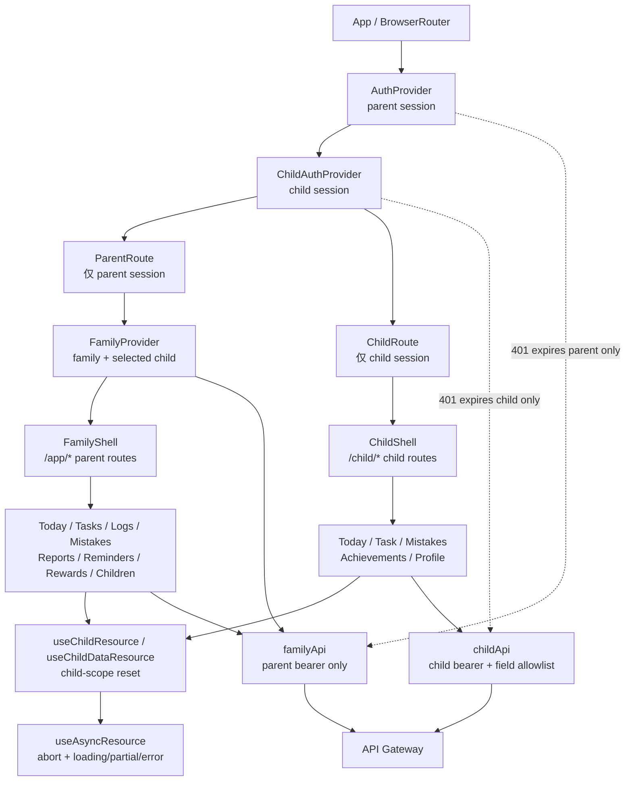

`AuthProvider` 与 `ChildAuthProvider` 可以同时挂载，但 session key、路由守卫和 API
客户端互不回退。家长切换孩子时 `FamilyContext` 递增 scope version、取消旧请求并
清空旧孩子缓存；孩子 API 始终从已验证会话推导 childId，并在客户端过滤可写字段。

## 9. 本地演示部署

第一阶段本地 Demo 只启动这些必要组件：

- `gateway`
- `user-service`
- `homework-service`
- `progress-service`
- `analytics-service`
- `notification-service`
- `resource-service`
- MongoDB
- `frontend/web`

`interaction-service`、会议、公告、复杂消息和移动端不作为首轮 Demo 必需服务。

Compose 和 Kubernetes 清单中保留的 `interaction-service` 属于兼容部署面。它可以随完整旧系统一起启动，但 Task 1-7 家庭成长基线不以该服务可用作为门禁条件；任何新的家庭 MVP 功能若需要亲子反馈或孩子自评，必须先在 Task 8+ 设计中定义 API、状态、权限和回归门禁。

MongoDB 必须以名为 `rs0` 的副本集运行。Compose 使用单节点副本集并由一次性初始化容器执行 `rs.initiate()`；所有服务连接串带 `replicaSet=rs0`。Kubernetes 使用单副本 StatefulSet、稳定主机名和初始化 Job；生产环境应替换为托管或至少三成员副本集。`progress-service` 启动时验证事务能力，不能在 standalone 上降级执行奖励兑换。

## 10. 非目标

第一阶段不做：

- 学校组织、班级、教师端和管理员后台。
- 视频会议、班级公告、群聊和消息已读。
- AI 周报、AI 解题、OCR 识别和自动批改。
- 专业体育测评、医疗健康判断和艺术等级评价。
- 新增微服务或复杂事件编排。
- 生产级定时任务系统。
