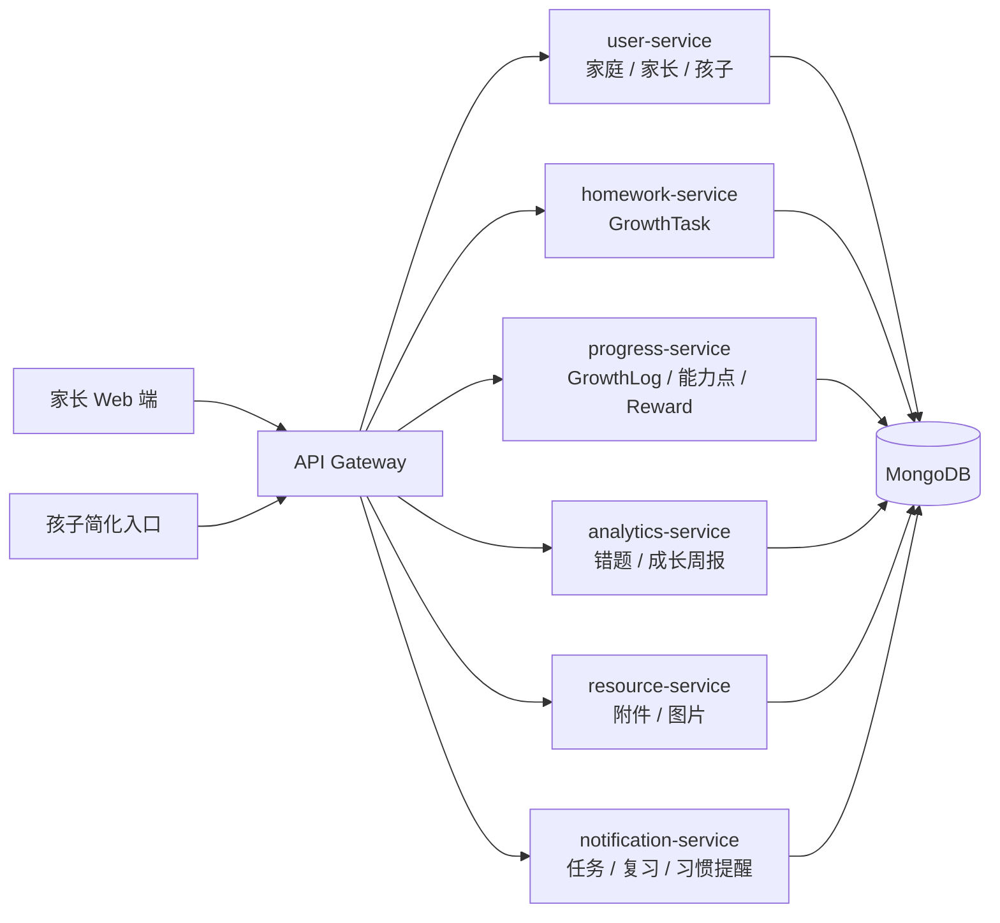

# 家庭成长跟踪架构设计

**Document status:** IN_REVIEW
**Baseline candidate:** FGT-MVP-1
**Decision records:**

- [ADR-0001: 复用现有服务](decisions/0001-reuse-existing-services.md)
- [ADR-0002: 家庭数据隔离](decisions/0002-family-data-isolation.md)
- [ADR-0003: 家庭本地日期](decisions/0003-family-local-date.md)
- [ADR-0004: 单次成长任务](decisions/0004-single-occurrence-growth-tasks.md)
- [ADR-0005: 幂等星星流水](decisions/0005-idempotent-star-ledger.md)
- [ADR-0006: Gateway 签名身份信封](decisions/0006-signed-gateway-identity-envelope.md)

## 1. 架构目标

家庭成长跟踪第一阶段的目标是把现有学校级 LMS 收敛为一个轻量、稳定、可演示的家庭成长闭环：

```text
家长账号
  -> 家庭与孩子档案
  -> 德智体美劳成长任务
  -> 孩子完成和自评
  -> 家长确认和反馈
  -> 智育错题 / 成长过程记录
  -> 成长周报和提醒
```

第一阶段不新增微服务，不强化学校组织结构。系统继续复用现有服务目录，但把公开接口和前端入口收敛到家庭成长场景。

## 2. MVP 模块图



## 3. 服务映射

| 现有服务 | 家庭成长版职责 | 第一阶段策略 |
| --- | --- | --- |
| `user-service` | 家庭、家长、孩子档案、孩子 PIN 登录 | 保留用户模型兼容字段，新增 `familyId`、`childProfile`、`parentProfile` |
| `homework-service` | 成长任务 `GrowthTask` | 保留旧 `Homework` 路由，新增 `/api/growth-tasks` |
| `progress-service` | 每日成长记录 `GrowthLog`、能力点、星星账户和奖励 | 保留旧进度模型，新增成长记录、能力点、积分流水和奖励路由 |
| `analytics-service` | 智育错题、固定模板成长周报、维度均衡统计 | 不做 AI 分析和复杂报表，先做确定性聚合 |
| `resource-service` | 任务附件、错题图片、成长过程图片 | 只保留最小上传和关联能力 |
| `notification-service` | 今日任务、未完成、错题复习、锻炼、习惯、周报提醒 | 第一阶段按读取时派生提醒，不引入后台定时任务 |
| `interaction-service` | 亲子反馈和孩子自评的后续扩展 | 第一阶段暂停会议、公告、群聊和复杂消息 |
| `gateway` | 统一鉴权、路由代理、下游用户头传递 | 继续作为本地 Demo 统一入口 |

### 3.1 跨服务读取与聚合策略

第一阶段继续使用同一个 MongoDB，但必须保留明确的数据所有权：

- `homework-service` 是成长任务的唯一写入方。
- `progress-service` 是成长记录、能力点、星星流水和奖励的唯一写入方。
- `analytics-service` 是错题和周报反馈的唯一写入方。
- `notification-service` 不持有任务、错题或周报副本，只派生查询结果。
- `analytics-service` 和 `notification-service` 需要跨域读取时，统一调用 `backend/common/repositories/familyReadRepository.js`。该只读仓储通过显式集合名和最小字段投影读取 MongoDB，只暴露按 `familyId + childId + LocalDate` 收敛的查询；它不注册写模型、不允许跨目录导入其他服务的私有 Mongoose 模型，也不允许写入其他服务集合。
- 只读仓储的查询必须设置超时；任一数据源失败时，周报返回 `503 AGGREGATION_UNAVAILABLE`，提醒接口返回已有分区结果并在 `meta.partial=true` 中声明降级，禁止静默返回完整成功结果。

该共享只读仓储是迁移阶段的临时边界。未来服务独立数据库后，应替换为内部 HTTP API 或事件构建的读模型，业务接口不改变。

### 3.2 日期与时区规则

- `Family.timezone` 使用 IANA 时区名，默认 `Asia/Shanghai`。
- `dueDate`、`GrowthLog.date`、`reviewReminderDate` 和 `weekStart` 均为 `YYYY-MM-DD` 的 `LocalDate`，不携带 UTC 偏移。
- `today` 按家庭时区计算；周从周一开始，到周日结束，查询区间两端均包含。
- 时间戳字段继续使用 UTC ISO 8601，例如 `completedAt`。
- 第一阶段每条任务只代表一次发生，不实现重复任务规则。每日习惯通过每天一条任务表达；重复任务模板推迟到第二阶段，避免单一任务状态无法表示“本周完成 4/7 次”。

### 3.3 Gateway 到下游服务的信任边界

```text
client JWT
  -> gateway 删除客户端提供的 x-user-* 和内部认证头
  -> gateway 验证 JWT
  -> gateway 签名 method + normalizedPath + userId + role + timestamp + nonce
  -> 下游验证签名、5 分钟新鲜度和 nonce 未重放
  -> 业务路由校验 familyId + childId 资源归属
```

- 身份信封使用独立的服务密钥，禁止复用 `JWT_SECRET`。
- gateway 必须覆盖而不是透传客户端身份头，包括 `x-user-id`、`x-user-role`、`x-user-name`、签名、时间戳和 nonce。
- 下游 `authenticateGateway` 必须先验签再构造 `req.user`，不能仅凭 `x-user-*` 信任调用者。
- nonce 在签名有效期内只能使用一次；签名篡改、时间戳超过 5 分钟或 nonce 重放都返回 `401`。
- 内部命令接口使用独立服务凭据，不能接受普通家长或孩子 token。
- 网络隔离是纵深防御，不能替代请求级服务认证；未来可以等价替换为 mTLS 或下游直接验证 JWT。

## 4. 核心域模型

### 4.1 Family

家庭是第一阶段的数据隔离边界。

关键字段：

- `familyId`
- `familyName`
- `timezone`
- `ownerParentId`
- `memberParentIds`
- `childIds`

| Field | Type | Required/default | Index and lifecycle |
| --- | --- | --- | --- |
| `_id` / `familyId` | ObjectId | required/generated | primary family boundary |
| `familyName` | String | required, trimmed, max 50 | mutable by family parent |
| `timezone` | String | required, default `Asia/Shanghai`, valid IANA name | mutable; new value affects future date interpretation only |
| `ownerParentId` | ObjectId | required | unique; one owned family per parent |
| `memberParentIds` | ObjectId[] | default owner | multikey lookup index |
| `childIds` | ObjectId[] | default empty | multikey lookup index; child must also carry same familyId |

家庭不在 MVP 中物理删除。停用家庭版路由不会删除家庭数据。

### 4.2 User

现有 `User` 模型继续保留 `parent` 和 `student` 角色。教师、管理员等旧角色不进入 MVP 导航，但为了减少迁移风险，第一阶段不删除旧枚举。

新增家庭字段：

- `familyId`
- `parentProfile.familyRole`
- `parentProfile.defaultChildId`
- `childProfile.nickname`
- `childProfile.school`
- `childProfile.grade`
- `childProfile.textbookVersion`
- `childProfile.interests`
- `childProfile.weakSubjects`
- `childProfile.sportsPreferences`
- `childProfile.artInterests`
- `childProfile.laborHabits`
- `childProfile.moralGoals`
- `childProfile.pinHash`
- `childProfile.tokenVersion`

| Field | Type | Required/default | Constraint |
| --- | --- | --- | --- |
| `familyId` | ObjectId | optional for legacy users, required for family parent/child | indexed with role |
| `childProfile.pinHash` | String | optional, `select: false` | bcrypt hash only; never returned |
| `childProfile.tokenVersion` | Number | required for family child, default `0` | incremented on PIN reset |
| `parentProfile.familyRole` | Enum | default `guardian` | `father|mother|guardian|other` |
| `parentProfile.defaultChildId` | ObjectId | optional | must reference same-family child |

旧教师、管理员和学生字段保留，但家庭版授权只使用 `familyId` 和资源归属，不使用 `class`、`parentId` 或旧 `children` 数组作为唯一依据。

### 4.3 GrowthTask

`GrowthTask` 是第一阶段替代学校作业的核心模型。每条任务必须属于一个成长维度。

维度枚举：

- `moral`：德育
- `academic`：智育
- `physical`：体育
- `artistic`：美育
- `labor`：劳育

关键字段：

- `taskId`
- `familyId`
- `childId`
- `dimension`
- `area`
- `subject`
- `title`
- `taskType`
- `description`
- `dueDate`
- `estimatedMinutes`
- `actualMinutes`
- `targetAmount`
- `actualAmount`
- `unit`
- `status`
- `difficulty`
- `needsHelp`
- `parentConfirmed`
- `childNote`
- `parentFeedback`
- `starAwardState: not_applicable|pending|awarded`

第一阶段不包含 `repeatRule`。重复任务进入第二阶段时，必须引入独立的任务模板和任务 occurrence，不能在单条任务上复用一个完成状态。

| Field | Type | Required/default | Constraint/index |
| --- | --- | --- | --- |
| `familyId` | ObjectId | required | compound indexes start with familyId |
| `childId` | ObjectId | required | must belong to familyId |
| `createdByParentId` | ObjectId | required | must be a parent in familyId |
| `dimension` | Enum | required | `moral|academic|physical|artistic|labor` |
| `dueDate` | String | required | `YYYY-MM-DD` LocalDate |
| `status` | Enum | default `pending` | `pending|completed|confirmed|archived` |
| `starAwardState` | Enum | default `not_applicable` | `not_applicable|pending|awarded` |
| `completedAt`, `confirmedAt` | Date | optional | UTC event timestamps |

Required indexes:

```text
{ familyId: 1, childId: 1, dueDate: 1 }
{ familyId: 1, childId: 1, dimension: 1, status: 1 }
```

#### GrowthTask 状态机

| Current | Command | Actor | Next/result |
| --- | --- | --- | --- |
| none | create | parent | `pending` |
| pending | edit | parent | `pending` |
| pending/completed | complete | parent or child self | `completed`; update completion evidence |
| completed | confirm | parent | `confirmed`; Task 5 adds idempotent star award |
| pending | delete | parent | physical delete |
| completed/confirmed | delete | parent | `archived` |
| confirmed/archived | complete | any | `409 TASK_STATE_CONFLICT` |
| any | create/edit with repeatRule | parent | `400 REPEAT_RULE_NOT_SUPPORTED` |

### 4.4 GrowthLog

`GrowthLog` 记录每日成长过程。它不是只记录课内学习，也记录体育、艺术、劳动和习惯状态。

关键字段：

- `logId`
- `familyId`
- `childId`
- `date`
- `dimension`
- `area`
- `subject`
- `content`
- `durationMinutes`
- `amount`
- `unit`
- `completedTaskIds`
- `focusLevel`
- `difficulty`
- `physicalState`
- `mood`
- `childReflection`
- `parentNote`

### 4.5 KnowledgePoint

`KnowledgePoint` 在智育中表示知识点，在其他维度中表示能力点或习惯点。

示例：

- 智育：分数计算、英语单词、阅读理解。
- 体育：跳绳耐力、跑步配速、篮球运球。
- 美育：节奏练习、线条观察、色彩搭配。
- 劳育：整理房间、洗碗、照顾植物。
- 德育：按时睡觉、主动道歉、遵守约定。

### 4.6 FamilyMistake

错题属于智育专项能力，`dimension` 固定为 `academic`。错题不应成为整个系统的唯一中心。

### 4.7 WeeklyReport

周报必须同时展示：

- 总记录天数。
- 总投入时长。
- 任务完成率。
- 德智体美劳任务分布。
- 德智体美劳投入时长分布。
- 智育错题和待复习知识点。
- 体育、美育、劳育、德育的完成情况。
- 家长反馈、孩子自评和下周建议。

周报查询是确定性、幂等的读取操作。`WeeklyReport` 只作为可失效缓存和反馈载体，缓存键为 `familyId + childId + weekStart`；源任务、记录或错题变化后必须重新计算统计字段。

### 4.8 StarLedgerEntry 与 Reward

星星使用不可变流水记录，不在 `User` 或 `Reward` 上直接维护可被并发覆盖的余额。

`StarLedgerEntry` 关键字段：

- `familyId`
- `childId`
- `type: earn|spend|adjust`
- `amount`
- `sourceType: task_confirmation|reward_redemption|parent_adjustment`
- `sourceId`
- `createdBy`
- `createdAt`

`familyId + childId + sourceType + sourceId + type` 必须建立唯一索引。家长首次确认任务后，任务先进入 `confirmed + starAwardState=pending`，随后 `homework-service` 调用 `progress-service` 内部积分命令；命令使用任务 ID 作为幂等来源，每个确认任务固定发放 1 颗星，重试不得重复加星。成功后任务更新为 `starAwardState=awarded`；失败返回 `503 STAR_AWARD_PENDING`，再次确认会重试未完成的发放。余额由流水求和得到，兑换奖励必须在一个事务中写入扣减流水并更新 `Reward.status`。

第一阶段只实现星星余额和家庭奖励兑换。徽章不进入 MVP，避免在没有规则版本、授予记录和撤销语义时只做静态展示。

## 5. 数据归属规则

所有家庭数据必须满足以下规则：

1. 家庭级对象必须携带 `familyId`。
2. 孩子拥有的数据必须同时携带 `familyId` 和 `childId`。
3. 任务、记录、错题、奖励、周报和提醒都不得只依赖用户角色判断访问权限。
4. 查询列表时必须先按 `familyId` 收敛，再按 `childId`、`dimension`、日期等业务条件过滤。
5. 跨服务数据聚合时，`childId` 只能在同一个 `familyId` 内使用。
6. 所有唯一索引都必须包含 `familyId`；调用者提供的 `familyId` 不可信，必须从已验证 token 和孩子归属关系推导。

## 6. 权限规则

### 6.1 权限矩阵

| Resource/action | Parent in family | Child self | Sibling | Other-family parent | Anonymous |
| --- | --- | --- | --- | --- | --- |
| Family read/update | allow | deny | deny | deny | deny |
| Child create/update | allow | deny | deny | deny | deny |
| Child profile read | allow | allow | deny | deny | deny |
| Child list | allow | deny | deny | deny | deny |
| PIN set/reset | allow | deny | deny | deny | deny |
| PIN login | public credential flow | public credential flow | public credential flow | public credential flow | public credential flow |
| Task list/detail | allow | allow own | deny | deny | deny |
| Task create/edit | allow | deny | deny | deny | deny |
| Task complete | allow | allow own | deny | deny | deny |
| Task confirm/delete | allow | deny | deny | deny | deny |
| Growth logs/mistakes | allow | allowed self fields | deny | deny | deny |
| Reports/rewards | allow | read own only | deny | deny | deny |

PIN 登录虽然不要求已有 token，仍必须使用统一凭据错误和限流，不能泄露家庭或孩子是否存在。

### 6.2 家长

家长可以：

- 查看和编辑自己家庭信息。
- 添加、查看、编辑自己家庭下的孩子。
- 为自己家庭下的孩子创建、编辑、确认任务。
- 查看和维护自己家庭下孩子的成长记录、错题、能力点、奖励和周报。

家长不能：

- 访问其他家庭的孩子。
- 访问其他家庭的任务、记录、错题、奖励和周报。

### 6.3 孩子

孩子可以：

- 使用 PIN 进入简化入口。
- 查看自己的今日任务、成长记录、错题复习和奖励。
- 标记自己的任务完成。
- 写自评、难度、实际用时、实际数量和是否需要帮助。

孩子不能：

- 查看兄弟姐妹的数据。
- 创建或确认家长任务。
- 修改家长反馈。
- 访问家长端设置。

### 6.4 教师和管理员

教师、管理员、班级和学校相关路由第一阶段仅作为旧代码兼容保留，不出现在 MVP 导航和演示闭环中。

## 7. 兼容、迁移与回滚

- MVP 保留 `Homework`、旧进度模型及学校角色枚举，不执行破坏性迁移。
- 新家庭路由只写入家庭域字段和新模型，旧学校路由不写入 `GrowthTask`。
- 家庭版 UI 隐藏学校、班级、教师和管理员入口，但不删除对应后端路由。
- 回滚通过停用家庭版 gateway 路由和 UI 导航完成，不删除家庭数据或旧学校数据。
- 当前 BSON Date 形式的家庭任务 `dueDate` 在切换到 LocalDate String 前必须另写迁移脚本：按家庭时区转换、验证 `YYYY-MM-DD`、保留备份字段并支持回滚。门禁整改期间没有已发布家庭数据时，可以通过测试数据库重建完成切换。
- 任何已批准基线语义变化都必须创建新 ADR 或更新替代 ADR，并同步 API、追踪矩阵和测试。

## 8. 前端信息架构

### 8.1 家长 Web 端

首轮导航：

- 首页
- 任务
- 记录
- 错题
- 成长
- 进度
- 孩子
- 设置

首页必须突出：

- 今日任务。
- 本周完成率。
- 本周成长投入时长。
- 德智体美劳分布。
- 待复习错题。
- 需要帮助。
- 本周鼓励语。

### 8.2 孩子简化入口

首轮导航：

- 今天
- 错题
- 成就
- 我的

孩子入口只保留完成、反馈和自评动作，不提供复杂管理能力。

## 9. 本地演示部署

第一阶段本地 Demo 只启动这些必要组件：

- `gateway`
- `user-service`
- `homework-service`
- `progress-service`
- `analytics-service`
- `notification-service`
- `resource-service`
- MongoDB
- `frontend/web`

`interaction-service`、会议、公告、复杂消息和移动端不作为首轮 Demo 必需服务。

## 10. 非目标

第一阶段不做：

- 学校组织、班级、教师端和管理员后台。
- 视频会议、班级公告、群聊和消息已读。
- AI 周报、AI 解题、OCR 识别和自动批改。
- 专业体育测评、医疗健康判断和艺术等级评价。
- 新增微服务或复杂事件编排。
- 生产级定时任务系统。
