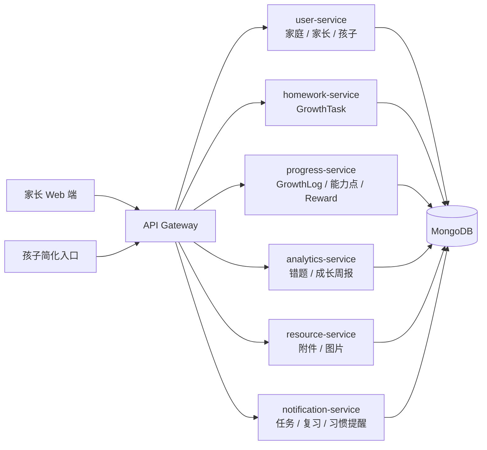

# 家庭成长跟踪架构设计

## 1. 架构目标

家庭成长跟踪第一阶段的目标是把现有学校级 LMS 收敛为一个轻量、稳定、可演示的家庭成长闭环：

```text
家长账号
  -> 家庭与孩子档案
  -> 德智体美劳成长任务
  -> 孩子完成和自评
  -> 家长确认和反馈
  -> 智育错题 / 成长过程记录
  -> 成长周报和提醒
```

第一阶段不新增微服务，不强化学校组织结构。系统继续复用现有服务目录，但把公开接口和前端入口收敛到家庭成长场景。

## 2. MVP 模块图



## 3. 服务映射

| 现有服务 | 家庭成长版职责 | 第一阶段策略 |
| --- | --- | --- |
| `user-service` | 家庭、家长、孩子档案、孩子 PIN 登录 | 保留用户模型兼容字段，新增 `familyId`、`childProfile`、`parentProfile` |
| `homework-service` | 成长任务 `GrowthTask` | 保留旧 `Homework` 路由，新增 `/api/growth-tasks` |
| `progress-service` | 每日成长记录 `GrowthLog`、能力点、奖励 | 保留旧进度模型，新增成长记录、能力点和奖励路由 |
| `analytics-service` | 智育错题、固定模板成长周报、维度均衡统计 | 不做 AI 分析和复杂报表，先做确定性聚合 |
| `resource-service` | 任务附件、错题图片、成长过程图片 | 只保留最小上传和关联能力 |
| `notification-service` | 今日任务、未完成、错题复习、锻炼、习惯、周报提醒 | 第一阶段按读取时派生提醒，不引入后台定时任务 |
| `interaction-service` | 亲子反馈和孩子自评的后续扩展 | 第一阶段暂停会议、公告、群聊和复杂消息 |
| `gateway` | 统一鉴权、路由代理、下游用户头传递 | 继续作为本地 Demo 统一入口 |

## 4. 核心域模型

### 4.1 Family

家庭是第一阶段的数据隔离边界。

关键字段：

- `familyId`
- `familyName`
- `ownerParentId`
- `memberParentIds`
- `childIds`

### 4.2 User

现有 `User` 模型继续保留 `parent` 和 `student` 角色。教师、管理员等旧角色不进入 MVP 导航，但为了减少迁移风险，第一阶段不删除旧枚举。

新增家庭字段：

- `familyId`
- `parentProfile.familyRole`
- `parentProfile.defaultChildId`
- `childProfile.nickname`
- `childProfile.school`
- `childProfile.grade`
- `childProfile.textbookVersion`
- `childProfile.interests`
- `childProfile.weakSubjects`
- `childProfile.sportsPreferences`
- `childProfile.artInterests`
- `childProfile.laborHabits`
- `childProfile.moralGoals`
- `childProfile.pinHash`

### 4.3 GrowthTask

`GrowthTask` 是第一阶段替代学校作业的核心模型。每条任务必须属于一个成长维度。

维度枚举：

- `moral`：德育
- `academic`：智育
- `physical`：体育
- `artistic`：美育
- `labor`：劳育

关键字段：

- `taskId`
- `familyId`
- `childId`
- `dimension`
- `area`
- `subject`
- `title`
- `taskType`
- `description`
- `dueDate`
- `estimatedMinutes`
- `actualMinutes`
- `targetAmount`
- `actualAmount`
- `unit`
- `status`
- `difficulty`
- `needsHelp`
- `parentConfirmed`
- `childNote`
- `parentFeedback`

### 4.4 GrowthLog

`GrowthLog` 记录每日成长过程。它不是只记录课内学习，也记录体育、艺术、劳动和习惯状态。

关键字段：

- `logId`
- `familyId`
- `childId`
- `date`
- `dimension`
- `area`
- `subject`
- `content`
- `durationMinutes`
- `amount`
- `unit`
- `completedTaskIds`
- `focusLevel`
- `difficulty`
- `physicalState`
- `mood`
- `childReflection`
- `parentNote`

### 4.5 KnowledgePoint

`KnowledgePoint` 在智育中表示知识点，在其他维度中表示能力点或习惯点。

示例：

- 智育：分数计算、英语单词、阅读理解。
- 体育：跳绳耐力、跑步配速、篮球运球。
- 美育：节奏练习、线条观察、色彩搭配。
- 劳育：整理房间、洗碗、照顾植物。
- 德育：按时睡觉、主动道歉、遵守约定。

### 4.6 FamilyMistake

错题属于智育专项能力，`dimension` 固定为 `academic`。错题不应成为整个系统的唯一中心。

### 4.7 WeeklyReport

周报必须同时展示：

- 总记录天数。
- 总投入时长。
- 任务完成率。
- 德智体美劳任务分布。
- 德智体美劳投入时长分布。
- 智育错题和待复习知识点。
- 体育、美育、劳育、德育的完成情况。
- 家长反馈、孩子自评和下周建议。

## 5. 数据归属规则

所有家庭数据必须满足以下规则：

1. 家庭级对象必须携带 `familyId`。
2. 孩子拥有的数据必须同时携带 `familyId` 和 `childId`。
3. 任务、记录、错题、奖励、周报和提醒都不得只依赖用户角色判断访问权限。
4. 查询列表时必须先按 `familyId` 收敛，再按 `childId`、`dimension`、日期等业务条件过滤。
5. 跨服务数据聚合时，`childId` 只能在同一个 `familyId` 内使用。

## 6. 权限规则

### 6.1 家长

家长可以：

- 查看和编辑自己家庭信息。
- 添加、查看、编辑自己家庭下的孩子。
- 为自己家庭下的孩子创建、编辑、确认任务。
- 查看和维护自己家庭下孩子的成长记录、错题、能力点、奖励和周报。

家长不能：

- 访问其他家庭的孩子。
- 访问其他家庭的任务、记录、错题、奖励和周报。

### 6.2 孩子

孩子可以：

- 使用 PIN 进入简化入口。
- 查看自己的今日任务、成长记录、错题复习和奖励。
- 标记自己的任务完成。
- 写自评、难度、实际用时、实际数量和是否需要帮助。

孩子不能：

- 查看兄弟姐妹的数据。
- 创建或确认家长任务。
- 修改家长反馈。
- 访问家长端设置。

### 6.3 教师和管理员

教师、管理员、班级和学校相关路由第一阶段仅作为旧代码兼容保留，不出现在 MVP 导航和演示闭环中。

## 7. 前端信息架构

### 7.1 家长 Web 端

首轮导航：

- 首页
- 任务
- 记录
- 错题
- 成长
- 进度
- 孩子
- 设置

首页必须突出：

- 今日任务。
- 本周完成率。
- 本周成长投入时长。
- 德智体美劳分布。
- 待复习错题。
- 需要帮助。
- 本周鼓励语。

### 7.2 孩子简化入口

首轮导航：

- 今天
- 错题
- 成就
- 我的

孩子入口只保留完成、反馈和自评动作，不提供复杂管理能力。

## 8. 本地演示部署

第一阶段本地 Demo 只启动这些必要组件：

- `gateway`
- `user-service`
- `homework-service`
- `progress-service`
- `analytics-service`
- `notification-service`
- `resource-service`
- MongoDB
- `frontend/web`

`interaction-service`、会议、公告、复杂消息和移动端不作为首轮 Demo 必需服务。

## 9. 非目标

第一阶段不做：

- 学校组织、班级、教师端和管理员后台。
- 视频会议、班级公告、群聊和消息已读。
- AI 周报、AI 解题、OCR 识别和自动批改。
- 专业体育测评、医疗健康判断和艺术等级评价。
- 新增微服务或复杂事件编排。
- 生产级定时任务系统。
