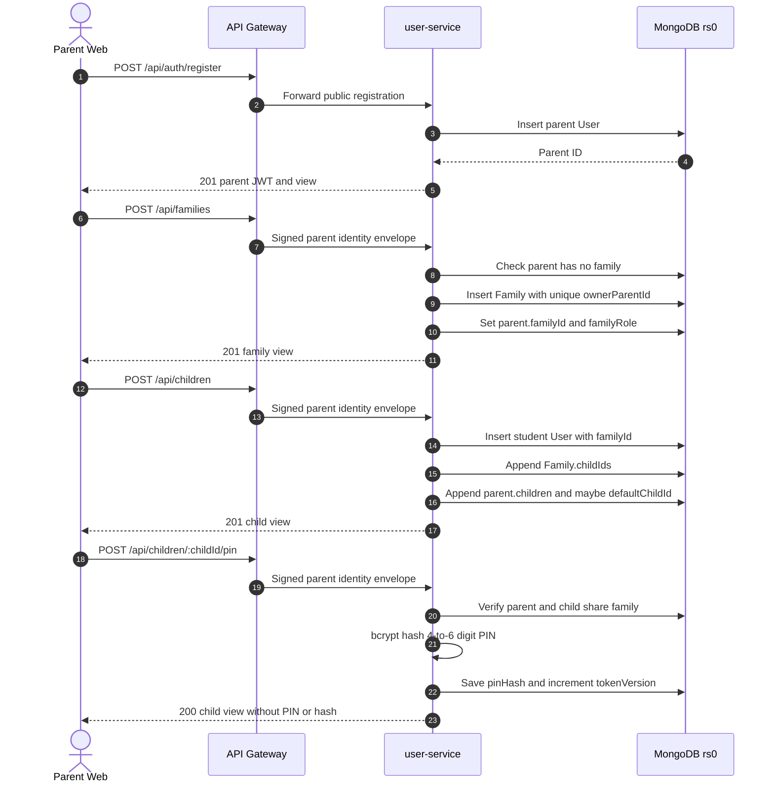
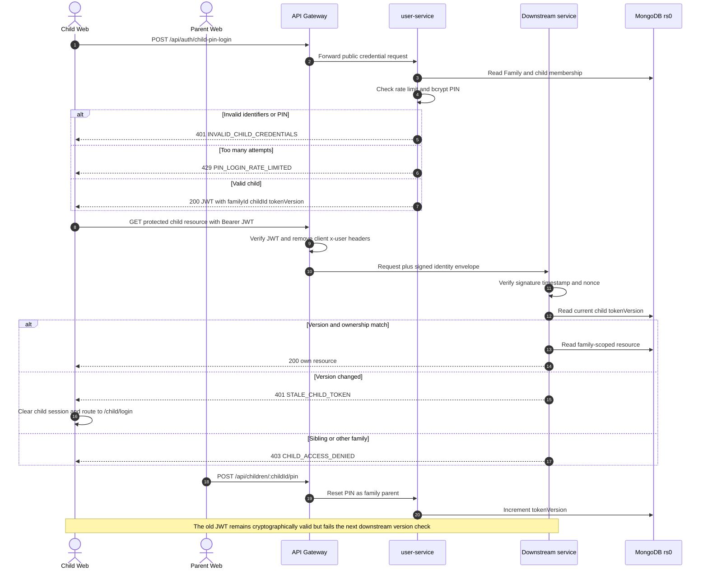
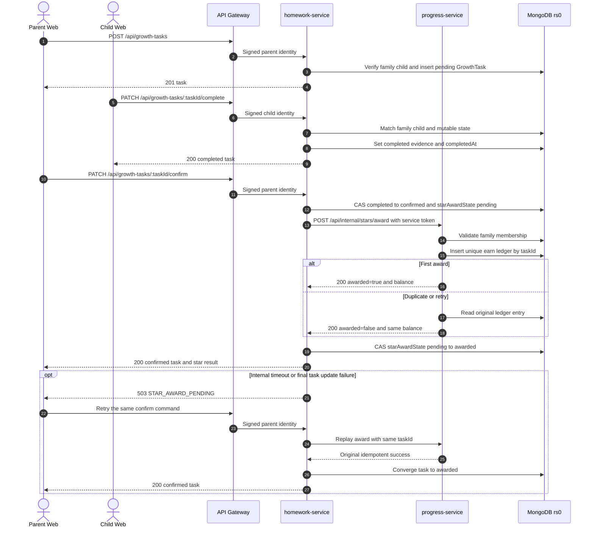
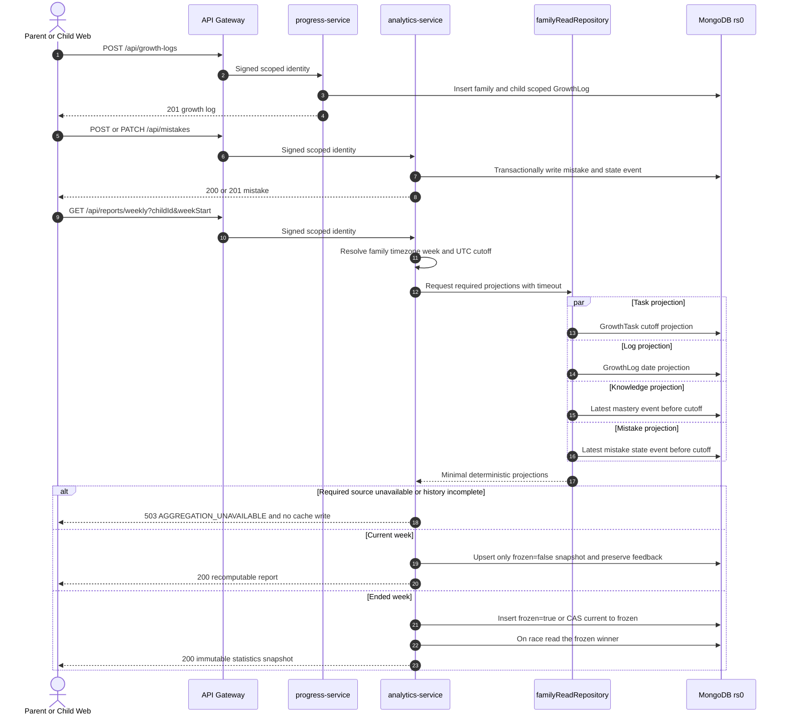
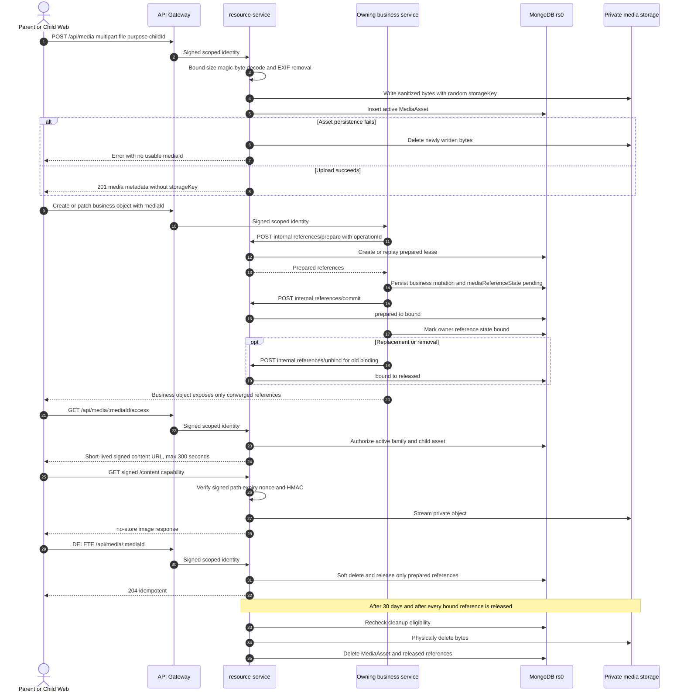
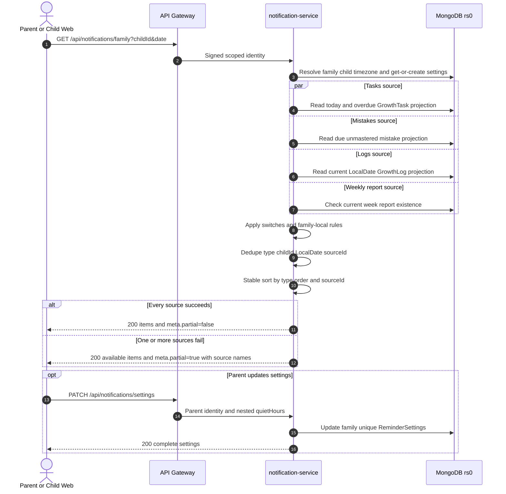
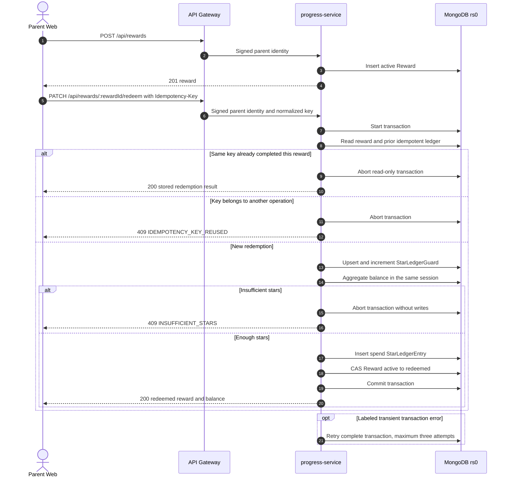
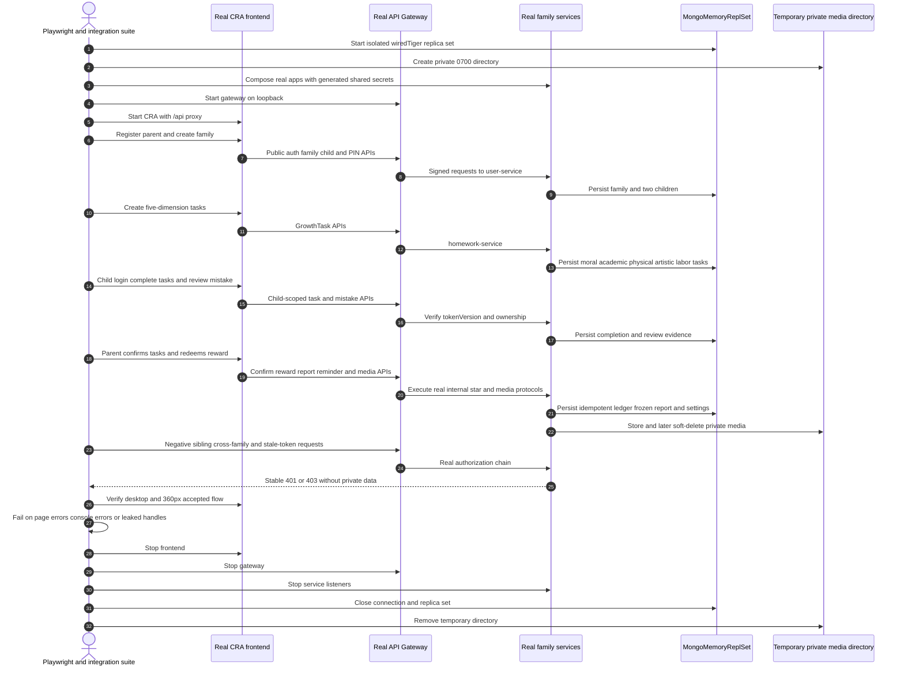

# 家庭成长跟踪跨服务时序图

**Document status:** FGT-MVP-1.7 IMPLEMENTED; TASK 1~12
**Scope:** Task 1~12 家庭成长功能的公开请求、内部命令、失败路径和一致性边界
**Updated:** 2026-07-13

本文与[产品需求](../product/family-learning-tracker.md)、
[总体架构](family-learning-tracker-architecture.md)、
[API 契约](../api/family-learning-tracker-api.md)及 Task 5~12 详细设计共同构成
权威设计输入。图中的客户端请求默认经过 API Gateway；只有星星发放和媒体引用
协议使用独立服务凭据绕过公开 gateway 路由。

## 1. 家长注册、创建家庭、添加孩子和设置 PIN



- **参与组件：** Parent Web、Gateway、user-service、MongoDB。
- **关键 API：** `POST /api/auth/register`、`POST /api/families`、
  `POST /api/children`、`POST /api/children/:childId/pin`。
- **失败与降级：** 无效时区、姓名或 PIN 返回 `400`；家长重复建家庭返回 `409`；
  跨家庭孩子操作返回 `403`。该流程没有可用的降级成功响应。
- **一致性保证：** `Family.ownerParentId` 唯一，PIN 只保存 bcrypt hash，重置 PIN
  与 `tokenVersion` 在同一个 User 文档写入。当前家庭创建和孩子创建包含多个顺序
  文档写，不是一个 MongoDB 事务；中途失败可能留下需要运维核对的部分关系，不能
  把收到 5xx 的请求解释为完整回滚。

## 2. 孩子 PIN 登录、身份信封和 stale token



- **参与组件：** Child Web、Parent Web、Gateway、user-service、任一家族域服务、
  MongoDB。
- **关键 API：** `POST /api/auth/child-pin-login`、任一孩子可访问的 `/api/*`、
  `POST /api/children/:childId/pin`。
- **失败与降级：** 登录错误统一为不泄露具体字段的 `401`；重放 nonce、过期信封或
  篡改头返回 `401`；兄弟姐妹和跨家庭访问返回 `403`。认证失败不得返回缓存数据。
- **一致性保证：** Gateway 覆盖身份头并签名 method、规范化路径、身份、时间戳和
  nonce；下游在每次孩子请求上比对持久化 `tokenVersion`。PIN 重置因此不需要维护
  token 黑名单，也能在下一次受保护请求上确定失效旧会话。

## 3. 创建任务、孩子完成、家长确认和星星发放



- **参与组件：** Parent Web、Child Web、Gateway、homework-service、
  progress-service、MongoDB。
- **关键 API：** `POST /api/growth-tasks`、
  `PATCH /api/growth-tasks/:taskId/complete`、
  `PATCH /api/growth-tasks/:taskId/confirm`、
  `POST /api/internal/stars/award`。
- **失败与降级：** 非法状态返回 `409 TASK_STATE_CONFLICT`；内部发放不可达或任务
  最终更新失败返回 `503 STAR_AWARD_PENDING`，由后续确认请求显式重试，不在单次
  HTTP 请求中无限重试。
- **一致性保证：** 任务状态转换使用条件更新；星星流水以
  `familyId + childId + sourceType + sourceId + type` 唯一，任务 ID 是幂等来源。
  跨服务操作不是分布式事务；任务保持 confirmed 时，`pending` 恢复状态和幂等命令
  可收敛且只发一星。当前把 pending-award 任务归档会终止公开 confirm 恢复，是需要
  在 v1.6 批准前决策的已知限制。

## 4. GrowthLog、错题和周报截止快照



- **参与组件：** Parent/Child Web、Gateway、progress-service、analytics-service、
  `familyReadRepository`、MongoDB。
- **关键 API：** `POST /api/growth-logs`、`POST|PATCH /api/mistakes*`、
  `GET /api/reports/weekly`、`PATCH /api/reports/weekly/:reportId/feedback`。
- **失败与降级：** 周报任一必需投影超时、结果异常或历史事件覆盖不足时整体返回
  `503 AGGREGATION_UNAVAILABLE`；周报不采用提醒接口的 partial 语义，也不把缺失源
  当作零。
- **一致性保证：** 错题/能力状态用不可变事件重建 cutoff；当前周可重算但不覆盖
  家长反馈，结束周通过唯一键和 CAS 冻结，竞争失败者读取同一个 frozen winner。

## 5. 私有媒体上传、绑定、读取、删除和清理



- **参与组件：** Parent/Child Web、Gateway、resource-service、持有媒体字段的业务
  服务、MongoDB、私有对象目录。
- **关键 API：** `POST /api/media`、`GET /api/media/:mediaId/access`、签名
  `/content`、`DELETE /api/media/:mediaId`、内部
  `/api/internal/media/references/{prepare,commit,unbind}`。
- **失败与降级：** 上传持久化失败会清理刚写入字节；commit 不确定时业务请求返回
  `503 MEDIA_REFERENCE_PENDING` 并由 detail/patch 恢复；过期、篡改或已删除的签名
  capability 被拒绝。删除后不再提供读取，即使物理字节尚在保留期。
- **一致性保证：** 引用命令按 operation ID 幂等；业务记录先保存 pending，再 commit
  引用，替换时先绑定新媒体后释放旧媒体。物理清理同时要求软删除满 30 天且不存在
  bound 引用，避免悬空业务引用或过早删字节。

## 6. 提醒派生和部分降级



- **参与组件：** Parent/Child Web、Gateway、notification-service、MongoDB 只读投影
  和 `ReminderSettings`。
- **关键 API：** `GET /api/notifications/family`、
  `GET /api/notifications/settings`、`PATCH /api/notifications/settings`。
- **失败与降级：** 单一来源失败不伪装完整成功，仍返回可用分区并设置
  `meta.partial=true`、列出 `unavailableSources`；认证、家庭归属或设置存储失败不降级。
- **一致性保证：** 提醒不持久化，按家庭 LocalDate 读取时确定性派生，以稳定语义键
  去重。`ReminderSettings.familyId` 唯一；quiet hours 在 MVP 仅存储和展示，因为没有
  push 调度器，不抑制 read-time reminders。

## 7. 奖励创建、事务兑换和幂等重放



- **参与组件：** Parent Web、Gateway、progress-service、事务可用的 MongoDB rs0。
- **关键 API：** `POST /api/rewards`、`GET /api/rewards`、
  `PATCH /api/rewards/:rewardId/redeem` 和 `Idempotency-Key` 请求头。
- **失败与降级：** 缺失或空白幂等键返回 `400`；键复用冲突或余额不足返回 `409`；
  仅标记为 transient 的事务错误最多重试三次。Mongo standalone 启动校验失败，不能
  降级为非事务兑换。
- **一致性保证：** `StarLedgerGuard` 串行化同一孩子余额写，扣减流水和 Reward CAS
  在同一事务提交。规范化幂等键同时用于查询和持久化，重放返回原结果且不重复扣星。

## 8. Task 11 端到端验收路径



- **参与组件：** Playwright/集成测试、真实 CRA 前端、真实 Gateway、真实 Express
  服务、`MongoMemoryReplSet`、临时私有媒体目录。
- **关键 API：** 第 1~7 节全部公开 API；内部调用只限生产设计已经存在的星星命令
  和媒体引用协议。测试不使用绕过产品行为的公共 seed endpoint。
- **失败与降级：** 任一必需服务、浏览器步骤、控制台错误、授权断言、资源清理或
  Git clean 检查失败都会使 Task 11 gate 失败；不使用 `continue-on-error` 或重跑把
  首次失败伪装成通过。
- **一致性保证：** 每个 suite 使用独立数据库名和媒体目录，外部时间/随机输入在
  测试边界固定；真实路由、中间件、模型、事务和 HTTP 客户端执行。关闭顺序在
  `finally` 中逆序运行，避免开放句柄或跨测试污染。

## 9. Task 12 第二家长邀请、加入和治理

```mermaid
sequenceDiagram
  actor Owner as Family owner
  actor Parent2 as Second parent
  participant Web as Parent Web
  participant Gateway
  participant User as user-service
  participant DB as MongoDB replica set

  Owner->>Web: Generate invitation
  Web->>Gateway: POST /api/families/:id/parent-invitations
  Gateway->>User: Signed owner identity
  User->>DB: Transaction: expire elapsed pending + create digest + audit event
  DB-->>User: committed
  User-->>Web: 201 clear token once + expiresAt

  Parent2->>Web: Open fragment invitation link and authenticate
  Web->>Gateway: POST /api/parent-invitations/preview (redacted body)
  Gateway->>User: Signed parent identity
  User->>DB: Hash token; read pending unexpired invitation and safe preview
  User-->>Web: family name, owner name, expiresAt

  Parent2->>Web: Accept and choose familyRole
  Web->>Gateway: POST /api/parent-invitations/accept (redacted body)
  Gateway->>User: Signed accepting parent identity
  User->>DB: Transaction: CAS invitation + conditional member add + User projection + event
  alt all conditions win
    DB-->>User: committed
    User-->>Web: updated family and two safe parent summaries
  else invalid/replayed/full/already-member/race loser
    DB-->>User: abort
    User-->>Web: stable 409 without token history
  end

  Owner->>Web: Transfer ownership or remove second parent
  Web->>Gateway: PATCH owner or DELETE member
  Gateway->>User: Signed current identity
  User->>DB: Transaction: re-check owner/member + mutate + append event
  DB-->>User: committed or rolled back
  User-->>Web: updated family or 204
```

- **参与组件：** 家长 Web、Gateway、user-service、MongoDB 副本集。
- **关键 API：** 邀请创建/读取/撤销/接受、退出、成员移除、所有权转移。
- **失败与降级：** 邀请不存在、过期、撤销或已使用统一返回
  `FAMILY_INVITATION_NOT_ACTIVE`；事务不可用时不降级为顺序写。
- **一致性保证：** Family、User、邀请和成员事件全部提交或全部回滚；并发接受最多
  一个成功；所有者始终在成员集合且家庭最多两位家长。
- **权限切换：** 家长 JWT 不作为家庭关系缓存。加入、退出、移除和转移后的下一次
  业务请求读取实时 Family 关系。父级 JWT/身份信封不提供授权性 `familyId`；包括
  resource-service 在内的下游服务忽略伪造或陈旧父级家庭声明。
- **前端 token：** React Router 从 fragment 读取邀请，登录/注册只保留白名单邀请回跳；
  接受成功以 replace 导航清除 token-bearing history，且不写浏览器持久存储。
- **升级前置：** Task 12 保持关闭，关系修复依次执行 dry-run、冲突处理、apply 和
  `--check`；只有零操作、零冲突且退出码为 `0` 才启用新 schema、路由和 UI。

## 10. 一致性模式汇总

| 场景 | 模式 | 权威恢复依据 |
| --- | --- | --- |
| 家庭和孩子创建 | 单副本集事务 | Family/User 交叉关系和事务回滚 |
| 孩子会话撤销 | 版本化 token | User.childProfile.tokenVersion |
| 任务确认发星 | 可恢复 saga + 幂等内部命令 | GrowthTask.starAwardState + 唯一 StarLedgerEntry |
| 周报历史 | cutoff 事件投影 + CAS 冻结 | WeeklyReport 唯一键和 frozen=true winner |
| 私有媒体绑定 | prepare/commit/unbind | MediaReference operationId、lease 和 state |
| 提醒 | 读取时派生 + 显式 partial | 稳定 reminderId 和 unavailableSources |
| 奖励兑换 | 单副本集事务 + 幂等键 | StarLedgerGuard、spend ledger、Reward CAS |
| Task 11 | 真实服务隔离验收 | 独立数据库/目录、固定时钟、强制 CI gate |
| Task 12 家长成员关系 | 单副本集事务 + 条件更新 + 不可变事件 | Invitation CAS、Family/User 关系、FamilyMembershipEvent |
