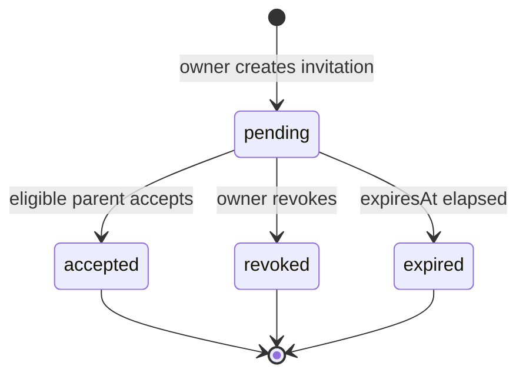
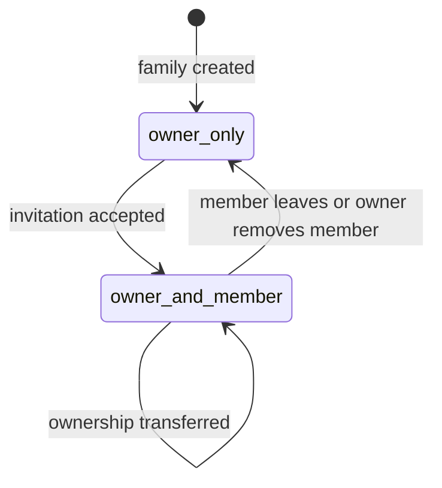

# Task 12 Second Parent Co-Management Design

**Document status:** APPROVED DESIGN / IMPLEMENTATION BASELINE
**Approved:** 2026-07-16
**Approved revision:** 2026-07-16 review remediation
**Baseline candidate:** FGT-MVP-1.7
**Scope:** Second-parent invitation, equal daily management, owner governance, membership audit, and parent Web flows
**Requirements:** `FR-FAM-004`, `FR-FAM-005`, `NFR-DATA-003`

## 1. Objective and Boundary

One family may contain at most two active parents. Both parents have equal access to every
ordinary family-growth workflow. The parent who created the family remains the governance
owner and alone may create or revoke an invitation, remove the second parent, or transfer
ownership. The second parent may leave voluntarily.

This increment does not add teachers, more than two parents, family dissolution, email
delivery, or dual-approval governance. It does not change child permissions or expose a
family identifier as an authorization credential.

## 2. Product and Permission Contract

### 2.1 Equal Daily Management

Both active parents may:

- read and update family name, timezone, and reminder settings;
- create, read, update, and confirm child tasks and growth records;
- manage child profiles, PINs, mistakes, attachments, knowledge points, rewards, and reports;
- switch among every child in the family;
- see the other parent's safe member summary and membership role.

All family services continue to authorize a parent through a live database relationship:
`Family.ownerParentId == parentId` or `Family.memberParentIds` contains `parentId`. A parent
JWT does not grant family access merely because it contains a stale `familyId` claim.

### 2.2 Governance Owner

The owner may create and revoke the single active invitation, remove the non-owner parent,
and transfer ownership to the active non-owner parent. The owner cannot leave while still
the owner and cannot remove themselves. The non-owner cannot remove the owner or another
member and cannot create, revoke, or inspect an invitation token.

The non-owner may leave. Leaving, removal, and transfer require an authenticated parent
request and a confirmation interaction in the Web client. Family dissolution is outside
Task 12.

### 2.3 Historical Data

Leaving or removal does not delete or anonymize tasks, confirmations, feedback, rewards,
mistakes, reports, media references, or audit fields created by that parent. Existing
creator and confirmer IDs remain historical attribution. The former member immediately
loses read and write access to the family.

## 3. Data Model

### 3.1 Family Invariants

`Family.memberParentIds` is the canonical active-parent set and obeys all of these rules:

- contains `ownerParentId` exactly once;
- contains one or two unique parent IDs;
- every ID refers to a `User` whose role is `parent` and whose `familyId` is this family;
- the owner is always an active member;
- a parent can be active in only one family.

`Family.childIds` remains the canonical child-membership source. `User.children` is retained
only as a compatibility projection for legacy readers. Membership transactions synchronize
that projection, but no Task 12 authorization decision reads it.

Every mutation that changes `Family.childIds` or active parent membership updates
`User.familyId`, `User.children`, and `parentProfile.defaultChildId` for every affected active
parent in the same transaction. A valid existing default child is preserved; a missing or invalid
default is repaired from the canonical child set. A failed projection write rolls back the
canonical write. The service does not perform a full-database relationship scan at startup:
historical drift is a release-preflight concern handled by the repair command and its strict
`--check` mode.

### 3.2 FamilyParentInvitation

| Field | Type | Constraint |
| --- | --- | --- |
| `familyId` | ObjectId | required; indexed |
| `invitedByParentId` | ObjectId | required; must be current owner at creation |
| `tokenDigest` | String | required; unique SHA-256 hex digest; never returned |
| `status` | String | `pending`, `accepted`, `revoked`, or `expired` |
| `expiresAt` | Date | required; creation time plus 72 hours |
| `acceptedByParentId` | ObjectId | required only when accepted |
| `acceptedAt` | Date | required only when accepted |
| `revokedAt` | Date | required only when revoked |
| timestamps | Date | Mongoose timestamps |

A partial unique index permits at most one `pending` invitation per family. Before creating
an invitation, the transaction changes any elapsed pending invitation to `expired`. Invitation
rows are retained for audit and therefore do not use a TTL deletion index.

The public token is 32 random bytes encoded with base64url. Only its SHA-256 digest is stored.
The clear token is returned exactly once by the create endpoint and may appear only in the
fragment of the user-copied invitation URL. URL fragments are not sent in HTTP request targets,
so Gateway and reverse-proxy access logs cannot capture it. It is also redacted from request-body
logging, errors, analytics, and audit events.

### 3.3 FamilyMembershipEvent

An append-only event is written in the same transaction as each governance mutation:

| Field | Type | Constraint |
| --- | --- | --- |
| `familyId` | ObjectId | required; indexed |
| `action` | String | `invitation_created`, `invitation_revoked`, `member_joined`, `member_left`, `member_removed`, `ownership_transferred` |
| `actorParentId` | ObjectId | authenticated actor |
| `targetParentId` | ObjectId | optional; member affected by the action |
| `invitationId` | ObjectId | optional; invitation-related actions only |
| `previousOwnerParentId` | ObjectId | ownership transfer only |
| `newOwnerParentId` | ObjectId | ownership transfer only |
| `createdAt` | Date | immutable event time |

No update or delete route is exposed for membership events. The ordinary family response does
not expose this audit collection.

## 4. Invitation and Membership State

Only `pending` and unexpired invitations can be accepted or revoked. Preview and acceptance of
a well-formed but unknown, expired, revoked, or consumed token return HTTP `409` with the same
`FAMILY_INVITATION_NOT_ACTIVE` code, message, and details. Only `requestId` may differ. The
canonical message is `Invitation is not active`, and the response contains no indication that a
token ever existed, its prior state, family, creator, or acceptor. This inactive-token decision
precedes accepting-parent eligibility checks; malformed or missing input remains `400`.

## 5. Transaction and Concurrency Design

All invitation creation, acceptance, revocation, member departure, removal, and ownership
transfer run on a transaction-capable MongoDB replica set through `runMongoTransaction`.

Invitation acceptance performs these checks and writes atomically:

1. Hash the presented token and select a `pending`, unexpired invitation.
2. Select the accepting `User` with role `parent` and no current `familyId`.
3. Conditionally add the parent to a family whose active-member count is below two.
4. Set `User.familyId`, selected `parentProfile.familyRole`, compatibility `children`, and
   default child where available.
5. Change the invitation from `pending` to `accepted` using compare-and-set.
6. Insert `member_joined` event.

If any condition loses a race, the transaction aborts. Two concurrent acceptors can produce
at most one accepted invitation and one two-parent family. A retry by the winner returns the
stable consumed-invitation error and does not duplicate membership or events.

Removal and departure atomically remove the member from `memberParentIds`, clear the member's
`User.familyId`, compatibility `children`, and default child, and append the event. Ownership
transfer atomically changes only `ownerParentId` and appends the before/after event; both parents
remain in `memberParentIds`.

Adding or changing a child atomically projects the canonical `Family.childIds` set and valid
default-child choice to both active parents. No create-child path may update only the requesting
parent. Projection maintenance is a write invariant, while `Family` remains the recovery and
authorization source.

## 6. Public API

| Method and path | Actor | Result |
| --- | --- | --- |
| `POST /api/families/:familyId/parent-invitations` | owner | create one 72-hour invitation and return clear token once |
| `GET /api/families/:familyId/parent-invitations/active` | owner | return safe active-invitation metadata without token or digest |
| `DELETE /api/families/:familyId/parent-invitations/:invitationId` | owner | revoke active invitation; return `204` |
| `POST /api/parent-invitations/preview` | authenticated parent | accept token in redacted body and return safe family/expiry preview |
| `POST /api/parent-invitations/accept` | authenticated parent | accept token and `familyRole`; return updated family and members |
| `DELETE /api/families/:familyId/members/me` | non-owner member | leave family; return `204` |
| `DELETE /api/families/:familyId/members/:parentId` | owner | remove active non-owner; return `204` |
| `PATCH /api/families/:familyId/owner` | owner | transfer ownership to active non-owner |

Family responses add a safe `parents` array containing `parentId`, `name`, `familyRole`, and
`isOwner`. Email, phone, username, invitation digest, and credential data are omitted.

Stable errors include:

| HTTP | Code | Meaning |
| --- | --- | --- |
| 400 | `VALIDATION_ERROR` | malformed ID, role, or body |
| 403 | `FAMILY_GOVERNANCE_DENIED` | active parent lacks owner governance permission |
| 409 | `FAMILY_PARENT_LIMIT_REACHED` | family already has two active parents |
| 409 | `FAMILY_INVITATION_ALREADY_ACTIVE` | family already has an unexpired pending invitation |
| 409 | `PARENT_ALREADY_IN_FAMILY` | accepting parent already belongs to a family |
| 409 | `OWNER_TRANSFER_REQUIRED` | owner attempted to leave |
| 409 | `FAMILY_INVITATION_NOT_ACTIVE` | token is invalid, expired, revoked, or consumed |
| 404 | `FAMILY_MEMBER_NOT_FOUND` | requested removable or transfer target is not an active member |

All errors use the existing family error envelope and contain no token or membership details
beyond the stable code. For inactive invitation preview and acceptance, the complete stable
`error.code`, `error.message`, and `error.details` are identical; only the per-request
`requestId` differs.

## 7. Authentication and Immediate Revocation

Parent access tokens and Gateway parent identity envelopes identify only the account and role for
family authorization; they do not contain an authoritative `familyId`. Every protected family
operation resolves the live `Family` relationship. Acceptance therefore does not require issuing
a new token, and removal or departure takes effect on the next family request even if the old
access token remains cryptographically valid.

Homework, progress, analytics, notification, and resource services must query Family with the
authenticated parent ID using `ownerParentId` or `memberParentIds`. In particular,
resource-service must ignore a parent `identity.familyId` or legacy `User.familyId` shortcut and
must not authorize media from a stale or forged parent family claim. Child identities continue to
carry `familyId`, `childId`, and `tokenVersion` for child-scoped authorization.

The invitation preview and accept endpoints require an authenticated `parent`; the public login
and registration routes preserve the invitation fragment in client navigation only. The server
never accepts a client-supplied parent ID as the joining identity and request logging must redact
the `token` body field.

## 8. Frontend Design

### 8.1 Routes and Navigation

Add `/app/family-members` to the parent shell and `/family/invitations#token=<token>` behind the
parent authentication boundary. The member page shows two stable slots, ownership status,
relationship, and the controls permitted to the current parent.

An unauthenticated visitor opening an invitation URL is redirected within the SPA to login while
preserving the token in the URL fragment, never a query string or server-visible path. The client
reads it through React Router `useLocation().hash`, preserves the full whitelisted return location
through both login and registration, and returns only to `/family/invitations`. It does not copy
the token to query parameters, request URLs, `localStorage`, or `sessionStorage`. After successful
acceptance, `navigate('/app/family-members', { replace: true })` removes the token-bearing history
entry so browser Back does not restore it.

### 8.2 Owner Interactions

The owner can generate an invitation, copy its link, view expiry, revoke it, remove the second
parent, and transfer ownership. The clear token remains component state only and is not written
to local storage. Reloading the page shows metadata without the token; obtaining a new copyable
token requires explicitly revoking the active invitation and generating another one.

Removal and transfer use explicit confirmation dialogs naming the effect. The removal dialog
states that historical records remain. Transfer states that governance controls move immediately.

### 8.3 Second-Parent Interactions

The invitation page displays family name, owner display name, expiry, and relationship selection.
Acceptance disables repeated submission and refreshes `FamilyContext` after success. A second
parent sees the same daily navigation and a leave control, but no invitation, removal, or transfer
control.

### 8.4 Responsive and Accessible Behavior

The flow must work at 360px and desktop width without horizontal overflow. Copy, revoke, accept,
leave, remove, and transfer controls have accessible names and visible focus. Status and errors
are announced as text and do not rely on color. Destructive commands use buttons rather than
clickable text.

## 9. Service and Compatibility Impact

User-service owns invitation, membership, and audit writes. Gateway exposes only the public paths
listed in section 6. Homework, progress, analytics, and notification retain their live
owner/member family lookup. Resource-service replaces its parent `identity.familyId`/
`User.familyId` shortcut with the same live Family lookup. Every service receives second-parent,
cross-family, forged-claim, and post-removal regression coverage as applicable.

Historical one-parent families are valid only after their owner is present exactly once in
`memberParentIds` and their compatibility projections agree with Family. The repair command must
normalize missing owner membership, duplicate IDs, stale `User.familyId`, and legacy
`User.children`. It reports conflicts and makes no write when one parent appears in multiple
families or when the discovered candidate member set would exceed two.

The release upgrade order is mandatory:

1. Keep Task 12 routes and UI disabled.
2. Run the repair command in dry-run mode and save its report.
3. Resolve every ambiguous multi-family or over-two-member conflict manually.
4. Apply deterministic repairs.
5. Run the command with `--check`; it must report zero pending operations and zero conflicts and
   exit `0`. Any operation or conflict exits nonzero.
6. Enable the new schema validation, Task 12 routes, and UI only after the check passes.

This preflight replaces a startup-time global scan. Runtime mutations still enforce the same
invariants transactionally.

Rollback disables Task 12 routes and UI while preserving invitation/event collections and current
two-parent relationships. Because existing service authorization already recognizes
`memberParentIds`, rollback does not remove the second parent or destroy history.

## 10. Test and Release Strategy

Implementation follows test-driven slices: model invariants, invitation lifecycle, acceptance
transaction, governance commands, cross-service authorization, frontend API/context, page flows,
then real gateway/browser acceptance. Unit-only mocks cannot close the membership gate.

The Task 12 gate requires:

- numbered `TC-T12-*` cases passing without retries;
- transaction-capable MongoDB evidence for concurrent acceptance and rollback;
- owner/member/cross-family authorization across every family service;
- parent tokens/envelopes without authoritative `familyId`, plus stale/forged parent family-claim
  rejection in resource-service;
- two-parent compatibility projection synchronization and a zero-drift release `--check`;
- frontend regression and production build;
- desktop and 360px Chromium invitation, co-management, transfer, and removal flows;
- two consecutive focused Task 12 integration runs with identical totals;
- full family regression, Task 11 regression, documentation check, and clean-worktree check.

No v1.7 implementation baseline or release claim is created until these checks pass and the
requirement traceability rows move from `DESIGN_APPROVED` to `COVERED`.
